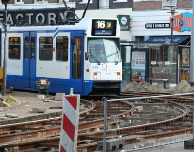

Il y avait déjà des travaux pendant de longs mois sur Ferdinand Bolstraat en raison de la construction de la ligne Noordzuid. Je vous ai parlé de [cette ligne](/noord-zuidlijn-ceintuurbaan-station) qui crée des nuisances pour travaux partout dans la ville et de cette [réouverture de la rue pour Noël](/noel-sur-ferdinand-bolstraat).

Aujourd'hui, c'est au croisement de la rue Ferdinand Bol et de la rue Albert Cuyp ([l'entrée du marché](/albert-cuyp-le-marche)) que le passage est bouché pour travaux. Il s'agit cette fois de refaire la chaussée. La chose n'est pas simple puisqu'il faut aussi tenir compte du passage des trams qui doit être maintenu. Les travaux ont donc lieu de nuit et dans la journée les rails sont posés sur des plots qui permettent aux seuls trams de passer. Les voitures sont détounés et les piétons sont priés de passer ailleurs. L'arrêt *Albert Cuyp* des trams 16 et 24 a d'ailleurs été déplacé.

{.center}

Heureusement; les travaux vont bientôt être terminés, jeudi dernier, je suis passé devant et les travailleurs avaient l'air de reboucher le trou, exactement au même endroit où d'autres travailleurs [réparait une caténaire au printemps](/le-tram-en-panne).
