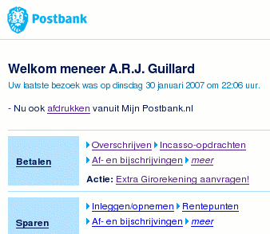

Je vous ai déjà dit qu'ici, ma banque, [c'est la Postbank](/postbank-amsterdam) (Le seul établissement qui m'a accepté en tant que chômeur). Jusqu'à présent, le peu d'argent que j'y déposait me permettais de faire mes petites courses quotidennes mais depuis novembre dernier, mon salaire est viré sur ce compte et la gestion de ce dernier par internet serait sûrement plus pratique. J'avais même reçu une pub me signalant que l'inscription au service *Internetbankiren* était gratuite.

## protection de mes données confidentielles

J'ai donc [fait la demande](https://mijn.postbank.nl/svc/aanvragen/aanvraagframe.html) pour recevoir mes données de connexion le 20 décembre dernier. Normalement une réponse devait m'être envoyée dans les 5 jours mais comme c'était les vacances, il m'a fallut attendre l'année d'après. En fait j'ai cru que cette demande était passée à la trappe et j'ai a nouveau rempli le formulaire le 5 janvier. C'est le lendemain que j'ai reçu par courrier mes données de connexion. Quand je dis données, il n'y a que l'identifiant, le mot de passe lui, est remis en main propre en présentant un formulaire et sa carte de paiement au guichet. Ce double circuit est très sécurisant.

## Toujours pas de connexion après un mois d'attente

Je n'ai pas trop compris pourquoi mais je n'a pas réussi [à me connecter](https://mijn.postbank.nl/internetbankieren/SesamLoginServlet). J'étais près à aller me plaindre quand quelques jours après je recevais le même identifiant dans un nouveau courrier. Il ne me restais plus qu'à aller chercher mon mot de passe. Le samedi suivant, je récupère donc mon nouveau mot de passe au *postkantoor* et l'essaye derechef. On est le 19 janvier et ma demande date d'un mois... Ce mot de passe ne marche pas non plus. Je suis près à changer de banque mais un texte rouge apparait sur ma page de connexion. Ce texte me dis en gros que après 3 tentatives de connexion ratées le login est bloqué. Pour le débloquer, il suffit de refaire une demande...

Cette fois ci, c'est la bonne, le 24 janvier, je reçois un troisième courrier avec mon identifiant ce qui me permet d'aller chercher mon nouveau mot de passe. Nouvelle visite au *postkantoor*, nouvel essai devant l'*ordinatoor*. Cette fois ci ça fonctionne, je suis connecté sur **mijn.postbank.nl**. Enfin# Pour des raison de sécurité, tout n'est pas encore activé, je dois encore donner mon numéro de compte, la date d'expriration de ma carte et ma date de naissance. Ensuite, la première chose que je dois faire avant de pouvoir utiliser mon *Internetbankieren*, est changer mon mot de passe... Comme s'il n'avait pas assez changé comme ça.

## Enfin!

{.center}

Je peux maintenant enfin faire des virement en ligne et savoir où j'en suis au jour le jour avec mes sous. Le site à l'air bien foutu avec quelques bonnes idées et une langue imbitable mais je vous parlerais de ça une autre fois.
---