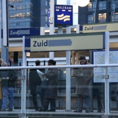
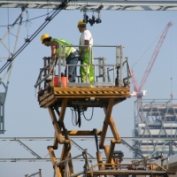

Je vous l'ai dit en vous présentant le quartier [Zuidas](/un-buurt-nomme-zuidas), la station de [mon boulot](/de-mon-boulot) a changé de nom en décembre 2007. Pour le moment, certain panneaux ont été changés. Les annonces vocales des trams annoncent aussi la nouvelle station avec une voix plus grave mais les panneaux sur mon quai de tram ont été renommés de manière provisoire (J'espère) comme on peut le voir la photo de gauche.

<!-- HTML -->
<table align=center cellpadding=3><tr><td align=center>
<!-- / HTML -->
[{.center}](http://flickr.com/photos/13274211@N00/391468176/)
**Station Zuid --WTC--**  
[agrandir](http://flickr.com/photos/13274211@N00/391468176/)
<!-- HTML -->
</td><td align=center>
<!-- / HTML -->
[{.center}](http://flickr.com/photos/13274211@N00/391443565/)
**NS Werknemers**  
[agrandir](http://flickr.com/photos/13274211@N00/391443565/)
<!-- HTML -->
</td></tr></table>
<!-- / HTML -->

Les panneaux seront surement changés un jour avec le reste du mobilier urbain. Pour le moment l'ensemble de la station est un chantier. Si vous avez lu mes articles, vous savez que cette station devrait avoir de plus en plus de trafic et peut-être même le futur [train à grande vitesse](/une-nouvelle-ligne-a-grande-vitesse). Deux nouvelles voies ont été construites à cet effet (la photo de droite montre la pose des catenaires) et les accès sont aujourd'hui en train d'être aménagés.

voir aussi : [Réparation de caténaire](/le-tram-en-panne)
---