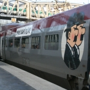

{.left}
Après un chouette week end en France, je rentre tranquillement le dimanche soir par **le thalys Paris -> Amsterdam**. Comme d'habitude, à Paris, il faut aller tout au bout du quai. Le train est long et composé de deux rames. la rame avant est à destination des Pays-Bas et la rame arrière s'arrète en Belgique, elle est détachée à la gare du midi à Bruxelles.

## Un cheminot centenaire

Cette rame avant était parsemée de bulles et de personnages d'Hergé. Un cheminot pélliculé passe sa tête à la fenêtre le foulard au vent. **C'est Tintin**, le héros des jeunes de 7 à 77 ans. Depuis le 10 janvier, Thalys fête le 100e anniversaire de Tintin (*Kuifje*). Une grande fresque a été innaugurée à la gare du midi et une rame du Thalys assure les liaison avec Tintin et ses compagnons pélliculés sur les flancs des wagons. (voir [le communiqué de la compagnie](http://www.thalys.com/nl/en/a_propos/presse/release/fr)).

{.center}

Pour Tintin comme pour Thalys, Bruxelles est l'attache centrale, le point ou l'on revient toujours après un voyage. Pour moi, qui prends cette rame de Paris à Amsterdam, Bruxelles n'est qu'un lieu de passage, une étape. Le temps de souhaiter une bonne soirée à ma voisine de trajet et je repars pour de [nouvelles aventures](http://meinamsterdam.nl).

* voir aussi : [Une nouvelle ligne pour trains à grande vitesse](/une-nouvelle-ligne-a-grande-vitesse).

* voir aussi aussi : [Un Thalys peut en cacher un autre](/un-thalys-peut-en-cacher-un-autre).

* voir encore  aussi : [Des travaux qui n'en finissent encore pas](/des-travaux-qui-n-en-finissent-pas-encore).
---