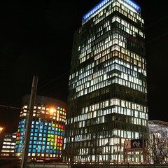

## Amsterdam's International Business Hub
[{.left}](http://flickr.com/photos/13274211@N00/360514331/)

<strong>Zuidas</strong> est présenté comme <em>Amsterdam's International Business Hub</em> et c'est là que je travaille. Un quartier qui épouse la tangeante sud du <a href="">périphérique Amstelodamois</a> et qu'il est facile de reconnaitre par la hauteur inhabituelle des tours. <em>Zuid-as</em> signifie d'ailleurs axe-sud, il est situé dans l'arondissement du <em>Zuideramstel</em> qui signifie l'Amstel du sud. Ce nouveau quartier est un grand projet urbain de quartier d'affaires comme le peut l'être La Défense à Puteaux et Courbevoie (<em>à l'ouest de Paris</em>). Il est bien désservit par l'axe rail-autoroute qui le traverse en son centre. La station <strong>Amsterdam Zuid</strong> (<a href="/station-zuid-wtc-devient-amsterdam-zuid">Anciennement Zuid WTC</a>) nottemment est le futur terminus de <a href="">la ligne Noord-Zuid</a> ainsi que le point de passage de nombreux trains, trams et métros en direction de partout. C'est par exemple ma gare la plus proche pour aller à l'aéroport de Schiphol.

<h2>Les secteurs</h2>

Le Zuidas est découpé en plusieurs zones qui, comme à Marne-la-Vallée ont leur caractéristiques propres et leur développement indépendant des autres. En voici les plus importants&nbsp;:

<ul>
<li><strong>World Trade Center et Zuidplein</strong>, situé au nord de la gare Amsterdam Zuid. Ce projet est le seul qui soit actuelemment terminé. Il est aussi le seul projet utilisant les bâtiments existants du World Trade Center d'Amsterdam (le WTC) date de 1985. Ces bâtiments ont été rénovés en 2002 et la <em>Zuiderplein</em> y a été aménagé devant l'entrée nord de la gare. De l'autre coté de la place, plusieurs tours ont été contruite dont la nouvelle tour de 105m de haut, la WTC H (voir photo) achevée en 2004. Ces bâtiments ont donné leurs noms à la gare <strong>Zuid WTC</strong> jusqu'à ce qu'elle soit rebaptisée <strong>Amsterdam Zuid</strong> en décembre 2006.</li>
</ul>
<ul>
<li><strong>Mahler4</strong> est situé en face du WTC de l'autre coté de la gare et de l'autoroute A10. Le projet à commencé en 2002 et il est aujourd'hui en partie livré puisque je travaille dans cette zone. Les immeubles sont regroupés autour d'une place (la Mahlerplein). D'un coté <a href="/abn-amro-banque/">ABN AMRO</a> y a construit son siège social et de l'autre des architectes renommés y ont contruit des immeubles <em>en forme de sculptures</em>. Les immeubles des deux dernières phase sont encore en construction.</li>
</ul>
<ul>
<li><strong>Gershwin</strong> est situé au sud de Maher4 et s'étand au sud jusqu'à de Boelelaan qui marque la limite sud de Zuidas. A l'ouest la zone Gershwin est limité par Buitenveldertselaan, tout comme la zone Malher4. Cette zone est située sur un ancien parc et sa vocation principale est résidentielle. Le premier projet de construction, Amsterdam <a href="http://drooderfiets.tumblr.com/post/94447997/devant-les-nouvelles-tours-symphonie-de-zuidas">Symphony</a> est une opération comprenant plusieurs tours d'habitations. Les travaux ont été lancés le 20 septembre 2006 en présence du Bourgmestre Job Cohen et la livraison des derniers lots est prévue pour 2010.</li>
</ul>
<ul>
<li><strong>Le quartier universitaire</strong>. À l'ouest Malher4, Il y a une grande zone encore non aménagée avec actuellement des terrains de tennis. Les terrains appartiennent à la mairie. À l'ouest de ces terrains, s'élèvent les bâtiments de l'une des deux universitées d'Amsterdam, la Vrije Universiteit (VU) ainsi que le Vrije Universiteit Medical Centre (VUmc)</li>
</ul>
<ul>
<li><strong>De Zuiderhof</strong> se trouve à l'ouest de ce quartier universitaire. L'opération immobilière comprend 9.140 m² de bureaux qui sont actuellement <a href="http://www.zuiderhof.com/">commercialisés par ING Real Estate</a>. Le siège social du groupe bancaire ING, un remarquable bâtiment en forme de paquebot sur pilotis, se trouvent à proximité, le long de la A10. </li>
</ul>
<ul>
<li><strong>La tête Zuidas</strong>, situé entre le boulevard d'Europe qui longe le RAI, la A10, et l'avenue président Kennedylaan, autour du RAI. C'est le secteur le plus oriental de Zuidas dont le but est de devenir un quartier de sorties. Le projet le plus porteur de cette idée est le projet de construction de la salle de concert Joop van den Ende qui devrait voir le jour en 2012.</li>
</ul>
<ul>
<li><strong>Vivaldi</strong>, est situé au sud la A10 et entre le boulevard d'Europe à l'est, le Boelelaan au sud et le quartier Gershwin à l'ouest. et la rue de cour. Cette zone est aussi bordée des parcs <strong>Beatrixpark</strong> et <strong>Amstelpark</strong>. Elle devrait être dans la continuité des zones Mahler4 et Gershwin. Pour le moment, seule la construction d'un immeuble de bureau pour le compte du cabinet Ernest &amp; Young y a débuté en 2005.</li>
</ul>
<ul>
<li><strong>ZuidasDok</strong>, est indiscutablement le projet le plus ambitieux et le plus complexe de tout Zuidas. Il prévoit de de faire passer la A10 ainsi que les voies de train, métro et tram qui longent le périphérique en souterrain. Ce tunnel multitransport s'étandra sur 1.200 metres entre le pont Amstelbrug et celui de Schinkelbrug. L'espace de 24 hectares libérés au dessus du tunnel sera utilisé pour de nouveaux programmes de construction. La société <strong>ZuidasDok NV</strong> a été crée en 2004 pour menner à bien ce projet qui devrait se terminer vers 2030.</li>
</ul>
<h2>Pour poursuivre la visite</h2>

La mairie a mis en place <a href="http://www.zuidas.nl/">un site d'information</a> proposant même une version anglaise. Le secteur Maher4 a aussi <a href="http://www.mahler4.nl/">son site web</a> dont le principal but est d'aider à la ventes des bureaux en construction. Il offre néamoins de nombreuses informations sur les phases de construction et l'aspect futur du quartier. Le secteur de la tête Zuidas aussi a <a href="http://www.kopzuidas.nl">son site web</a> informatif qui montre que le quartier aura ici une autre typologie. Le projet de quartier Vivaldi est visible sur <a href="http://www.ciiid.nl/project.asp?cat=3&amp;prj=778-VIVALDI">le site de ses architectes</a>. Quelques autres projections de l'avenir sont disponibles sur <a href="http://deltametropolis.nl.tripod.com/nl/id18.html">cette page perso</a> en néerlandais. Enfin, <a href="http://zuidas.webcam.nl/">une webcam</a> vous permettra peut être de me voir passer dans le quartier tous les matins si l'autofocus est avec vous.

<!-- post notes:
http://www.emporis.com/en/wm/zo/?id=100221
http://nl.wikipedia.org/wiki/Zuidas
--->
