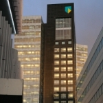

L'actualité financière a été dominé cette semaine par l'annonce de la possible fusion de la banque néerlandaise **ABN Amro** avec la banque britanique **Barclays**. Les deux banques ont juste annoncé qu'elles entammaient des discussions envisageant une fusion de leurs deux établissements. Je n'est rien à ajouter de ce qui s'est dit dans la presse mais je peux en profiter pour vous présenter la première banque des Pays-Bas.

[{.left}](http://flickr.com/photos/13274211@N00/433605790/)
**ABN** reprend les initiales de ***Algemene Bank Nederland*** qui signifie banque générale des Pays-Bas. cette banque existe depuis 1964, de la fusion de la ***Nederlandsche Handelmaatschappij*** (NHM) et de la ***Twentsche Bank***, deux banques néerlandaises crées au 19e siècle. **Amro** est l'acronyme de Amsterdam et de Roterdam. L'**Amro Bank** est aussi née en 1964 d'une fusion entre l'***Amsterdamsche Bank*** et la ***Rotterdamsche Bank***. portant le nom des deux plus grandes villes du pays. c'est en 1991 que ABN et Amro bank ont fusionné pour former ABN Amro, la première banque des Pays-Bas.

ABN Amro a des activités dans de nombreux pays. Elle est surtout présente au Brésil (Banco Real), en Italie (Antonveneta), aux États-Unis et au Moyen Orient. La Banque Barclays est présente au Royaume-Uni mais aussi en France, en Espagne où au Portugal et cherche à développer ses activités à l'international. Une fusion avec ABN Amro semble présenter une bonne complémentarité. Les dépèche parlant de cette fusion indiquent que la direction de la nouvelle banque européenne aurait un management anglais et son siège social à Amsterdam (sûrement parce que les impots des sociétés sont moins élevés aux Pays-Bas [lire à ce sujet](/descente-de-flics-chez-les-voisins) ).

{.center}

Actuellement le siège social mondial d'ABN Amro est à deux pas de [mon boulot](/de-mon-boulot). La tour des **ABN AMRO World HQ** domine [le quartier Zuidas](/un-buurt-nomme-zuidas) depuis 1999 et c'est ce siège social qui a vraiment lancé le développement du nouveau quartier d'affaires.

Ce siège social est maintenant le [siège néerlandais de Royal Bank of Scotland](/les-deboires-de-la-royal-bank-of-scotland) qui a [racheté la banque à l'été 2007](/les-petites-courses-de-l-ete).
---