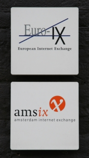

Concernant les activités d'échange, Amsterdam a souvent été à la pointe mais aujourd'hui, la ville est loin de la première place mondiale pour les échanges portuaires ou financiers. C'est aujourd'hui dans l'immatériel et les réseaux qu'Amsterdam retrouve cette première place mondiale. Cette activité est une des activités de base du Grand Ternet et ce sont les hollandais les meilleurs.

### Les points d'échange Internet
Pour être connecté à l'Internet, il faut un fournisseur d'accès. Mais vous êtes vous déjà demandé comment le fournisseur d'accès vous mettait en relation avec d'autres prestataires internet ? Comment avez-vous accès à des sites web au Japon ou comment le mail que vous avez envoyé chez un prestataire concurent arrive dans la bonne boîte ? C'est simplement parce que les réseaux de chaque prestataire sont interconnectés (c'est d'ailleurs pour celà que l'on dit *Internet*). Dans les faits, cette interconnexion n'est pas gratuite, il faut physiquement connecter ses serveurs à ceux du voisin et si chaque prestataire devait le faire séparément cela couterait très très cher. L'idée est donc de se grouper avec de nombreux prestataires pour réaliser ces interconnexions au sein d'un même établissement. Cet établissement s'occuperait de l'infrastructure et chaque membre pourrait alors définir sa politique d'interconnexion avec ses nombreux voisins. Les frais de la structure serait partagés par l'ensemble des membres qui l'utilisent.

{.left}

Ce genre de structure existe dans tous les pays du monde et on les appelle des point d'échanges Internet. Leur nom termine nouveant par *IX* pour *Internet Xchange*.

### AMS-IX
AMS-IX a été créé au début des années 90 quand les réseaux scientifiques locaux ont eu besoin de connecter leur réseaux. La première interconnexion avec l'étranger a été mise en place en 1994 avec le CERN de Genève, là ou travaillait l'inventeur du Web. Petit à petit, les opérateurs privés sont autorisés à s'interconnecter sur le site d'AMS-IX si bien qu'en 1997 ils créent une association pour gérer la structure. Les interconnexions avec les gros câblo-opérateurs ainsi qu'avec les fournisseurs de services Internet du monde entier.

Selon [leur site](http://www.ams-ix.net/about/history.html) c'est en 2003 qu'ils deviennent le point d'échange avec le plus grand nombre d'interconnexions (178 fin 2003) et en 2005 qu'ils annoncent être le point d'échange du monde assurant le plus gros trafic. Ceci leur a vallu une dépèche parlant du [rêgne de la liberté Internet à Amsterdam](http://uk.news.yahoo.com/29092006/80-91/amsterdam-internet-freedom-reigns.html).

### Et l'Europe
Quelques points d'échange sont directement administrés par des opérateurs mais la plupart des points d'échanges Européens sont administrés comme AMS-IX. L'envie de partager les expériences de chaque point d'échange pour mieux gérer chaque structure est née et AMS-IX est le principal fondateur d'[Euro-IX](http://www.euro-ix.net/), un groupement européen de points d'échange Internet. Le siège d'Euro-IX est à Amstrerdam, dans les mêmes bureaux que AMS-IX.

* Voir aussi le compte rendu du [RIPE Meeting 55](/c-etait-ripe-55-meeting) où AMS-IX et Euro-IX étaient présents.
