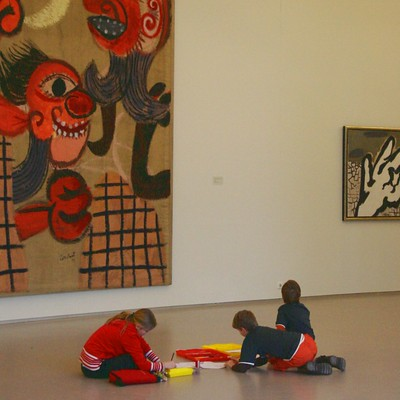

Il y a un mois, nous sommes allé au **musée CoBrA pour l'art contemporain** (*[Cobra museum voor moderne kunst](http://www.cobra-museum.nl/)*) à Amstelveen, au sud d'Amsterdam. Moi qui ne connaissais pas ce mouvement, j'ai été enchanté de le découvrir dans ce musée. 

Comme le dit bien la [page Wikipédia sur CoBrA](http://fr.wikipedia.org/wiki/Cobra_%28mouvement%29), CoBrA reprends les premières lettres des villes où étaient établit les artistes fondateurs du mouvement : **Co**penague, **Br**uxelles, **Am**sterdam. Ayant la chance d'habiter dans la troisième de ces villes, j'ai pu constater qu'ici, le mouvement est surtout connu grâce à quelques peintres locaux et en particulier **Karel Appel** et **Guillaume Corneille** (*[Cornelis Van Beverloo](http://fr.wikipedia.org/wiki/Guillaume_Corneille)*). C'est pourtant un autre artiste, plus méconnu, sur lequel j'ai flashé, __[Anton Rooskens](http://fr.wikipedia.org/wiki/Anton_Rooskens)** pour lequel le musée rendait un homage par le biais d'une exposition temporaire.

[{.center}](https://www.flickr.com/photos/13274211@N00/395859054)

La page Wikipédia sur CoBrA indique aussi que le mouvement se ''réfère à l'art populaire nordique, à l'art primitif, aux dessins d'enfants, à l'expressionnisme et à l'automatisme surréaliste''. Pour ce qui est des dessins d'enfants, on peut dire que la boucle est bouclée. Quelques gamins ont passé leur après-midi à jouer dans les salles presque vides du musée il se sont amusés à reproduire les toiles accrochées au mur. On les voient ici devant une toile de **Lucebert** (*Lucebertus Swanswijck*) et un tableau monumental de **Constant** (*[Constant Van Nieuwenhuis](http://fr.wikipedia.org/wiki/Constant_Van_Nieuwenhuis)*).
