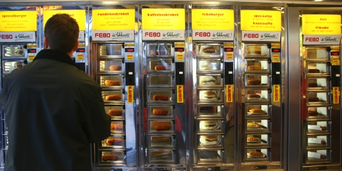
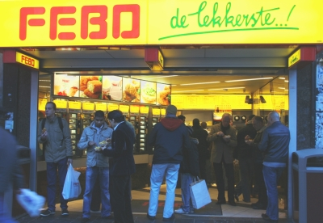

Le mois écoulé, je vous ai parlé bouffe, de la [super bonne](/fin-de-la-semaine-du-gout) et de la [moins chouette](/le-lunch-du-midi). Pour compléter la série, il me faut absolument vous parler de cette chaine de fast food néerlandaise dont la nourtiture sort de machines qui me rappellent les tirettes à cent balles. Il y a donc ici des distributeurs automatiques de junk food.

<!--excerpt-->

## La chaîne FEBO
FEBO est une chaine Néerlandaise de fast-food (en Néerlandais *Snackbar*) dont la singularité est de servir ses aliments dans des distributeurs automatiques. Un comptoir reste à disposition des clients pour la vente de boissons et de frites.

## Histoire de FEBO
À l'origine, *Maison FEBO* est le nom d'une boulangerie située [rue Ferdinand Bol](/noel-sur-ferdinand-bolstraat) dans le quartier du *Pijp* à Amsterdam. C'est d'ailleurs de cette rue qui a inspiré le nom de cette boulangerie ouverte en 1941. Son propriétaire, **J.I. de Borst** faisait divers produits à emporter et snacks qu'il vendait via un distributeur automatique. Selon [le site web de la compagnie](http://www.febo.nl), les produits étaient réputés de bonne qualité et étaient très demandés si bien qu'il fallut agrandir la cuisine et ouvrir d'autres sucursalles dans la ville. En se développant, la boulangerie a arrêté de faire du pain et s'est renommé FEBO. 

[{.center}](http://commons.wikimedia.org/wiki/Image:Distributeurs-febo.jpg)

## FEBO Aujourd'hui
Le site web de la société revendique 60 magasins à travers tous les Pays-Bas dont 54 sont des franchisés. 22 de ces magasins sont situés à Amsterdam et vendent des produits fabriqués dans une cuisine ultra moderne située au nord de la ville.

## De lekkerste!
La plupart des produits vendus sont des snacks néerlandais connus, des **croquettes** et des **fikadel**. Febo propose aussi des **hamburgers** ainsi que des **brochettes de poulet au saté** qui témoigne de l'influence de la cuisine Indonésienne aux Pays-Bas. Une [description des produits est disponible sur le site](http://www.febodelekkerste.nl/catalog/). 

**de lekkerste!** signifie **le meilleur**. Je ne peux pas vous dire si ce slogan est de la publicité mensongère ou non, je n'ai pas essayé un seul produit de chez Febo, j'ai passé l'âge des tirettes à cent balles. Ce n'est pas le cas de tout le monde, ces fast-food ne désemplissent pas.

{.center}
