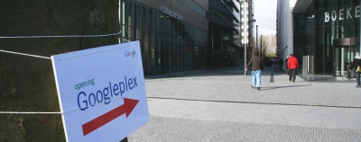
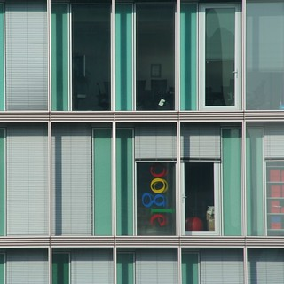

Dans la tour où je bosse, nous avons depuis quelques temps de nouveaux voisins, ils sont plus respectables que [les autres dont j'ai parlé](/descente-de-flics-chez-les-voisins) et mondialement connus. **Google Nederland BV**, filliale de la société Internet Étasuinienne du (presque) même nom, a installé ses bureaux au 15e étage de la tour où je travaille (au 6ème). Ils ont quité la tour WTC de l'autre coté de [la gare](/station-zuid-wtc-devient-amsterdam-zuid) pour des bureaux plus grands. Mercredi, il y avait [une soirée avec petits fours](http://weblog.pcmweb.nl/2007/03/google_groeit_a.html) pour fêter l'évènement et aussi pour que les journalistes parlent d'eux.

{.center}

Aux Pays-Bas, Google a essentiellement une activité commerciale autour de la publicité en ligne et les fameux *Adwords*. Aucun poste technique n'est à pourvoir à ce 15ème étage. Par contre il semblerait qu'ils cherchent encore des commerciaux.

### Les anciens bureaux:

[{.center}](http://flickr.com/photos/13274211@N00/433605792/)

