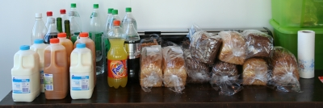

En France, quand on est gamin, on chante ''J'aime mieux manger à la cantine...'' mais aux Pays-Bas, on apprend la chanson quand on est adulte...

{.center}

Dans ma boite, nous disposons d'une superbe cuisine, avec une grande table, des fauteuils et une vue imprenable sur Amsterdam. Tous les jours, vers midi, tous les employés prennent d’assaut cette cuisine pour y absorber quelque nourriture. On appelle ça le **lunch**. 

[lunch](prepared-to-lunch-200.jpg){.left} Tout est prévu pour que chacun soit satisfait. il y a là un grand choix de **pain-de-mie** de toutes les couleurs et des litres et des litres de **lait**[^1]. 

Pour recouvrir ces tranches de pain, on nous offre de la **charcuterie** insipide en tranches et plein de sortes de **fromages** à pâte compressés en tranches aussi. Il y a aussi des **salades**, des **concombres** et des **tomates** en toute saison pour aider les gens à varier la garniture de leurs tranches moles. Ceux qui ont le palais sucré peuvent choisir entre **le beurre de cacahuète**, la **confiture** ou les ***hagelslag*** ces copeaux de chocolat ou de sucre qu'on fait coller à la tartine grâce à une bonne épaisseur de beurre. 

**Le lunch se passe de cette manière dans de nombreuses entreprises Néerlandaises**. J'ai la chance d'être dans une boîte offrant un choix varié. Il y a parfois du *brie de hollande* et des sauces aux couleurs bizarres dans des boites dont les étiquettes expliquent que le contenu s'appelle ''salade de poulet' ou *de thon*[^2]. Un grille-pain et des machines à croque-monsieur sont à disposition pour ceux qui veulent manger chaud. Moi j'aime bien manger chaud à midi alors tous les midis depuis trois mois, je me fais un croque-monsieur. Mmmmmmh c'est bon…

Après ça il y a aussi souvent des fruits à disposition dans de jolis corbeilles. Mais parfois, il n'y a plus de fruit en fin de repas. Le problème avec une cuisine avec tant de bonnes choses à disposition comme celà, c'est que certains collègues en profitent pour grignoter le matin et l'après midi, alors parfois, il n'y a plus de fruit le midi. Mais bon, c'est pas grave parce que parfois on en profite aussi...

La boite semble généreuse à notre égard de nous fournir autant de bonnes choses à manger. C'est d'ailleurs pour éviter que le fisc ne prenne tout ceci pour des avantages en nature, que la somme de 2€ par jour est prélevé sur notre salaire.

---
[^1]: Il y a aussi des sodas qui ont peu de succès et des jus de fruits pour les lactophobes et les étrangers
[^2]: Une fois, j'ai essayé de trouver les bouts de poulet ou de thon mais je n'ai pas trouvé alors je préfère ne pas insister sur ces produits.
