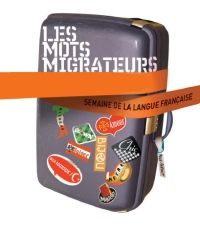
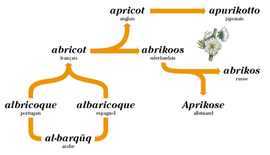

{.left} Hier, en regardant la télé, j'ai remarqué un petit programme expliquant commant le mot abricot avait voyagé de l'arabe **al barquq** au français **abricot** pour être ensuite diffusé dans les pays germains où il a donné par exemple **abrikoos** en Néerlandais. 

Ce court programme faisait partie d'une série de 10 diffusés le soir sur TV5 à l'occasion de **[la semaine de la langue française](http://www.semainelf.culture.fr)**. J'ai un peu loupé cette semaine du **10 au 20 mars** mais il faut dire que je ne passe pas mon temps à regarder TV5 et que les Pays-Bas ne faisant pas partie de la francophonie, il est possible de passer au travers. C'est dommage parce que j'adore regarder voyager les abricots...

{.center}

### Nouveaux mots

[Ces 10 émissions courtes](http://www.tv5.org/TV5Site/lf/semaine_lf.php) mettaient en scène des mots français qui ont une histoire internationnale. L'occasion est trop belle pour vous parler de ces mots français qui ont une histoire ici aux Pays-Bas. Les Néerlandais sont de grands adopteurs de vocabulaire étranger. Il y a longtemps, la langue française était une langue européenne de référence et [les bataves ont naturellement pioché dans notre vocabulaire](http://nl.wikipedia.org/wiki/Frans_in_Nederland) pour s'exprimer plus précisément. 

**Abattoir**,
**au pair**,
**bagatel**,
**bric-à-brac**,
**bureau**,
**cadeau**,
**caissière**,
**carrosserie**,
**chassis**,
**chauffeur**,
**coulisse**,
**depot**,
**eau de cologne**,
**enfin**,
**etage**, 
**fait divers**,
**faux pas**,
**fin de siècle**,
**foie gras**,
**[française](/nouveau-mot-francaise)**,
**garage**,
**haute couture**,
**hors d'oeuvre**,
**jus d'orange**,
**lingerie**,
**maîtresse**,
**mise-en-scène**,
**negligé **,
**papier-maché **,
**paraplu **,
**pied-à-terre**,
**pince-nez**,
**portemonnee **,
**portmanteau**,
**première**,
**prêt-à-porter**,
**rendez-vous**,
**retour**,
**souffleur**,
**tête-à-tête**,
**trompe-l'oeil**,
**trottoir**,
**vis à vis** et **wagon** sont tous des mots Néerlandais et ne sont pas de faux-amis. 

Voilà une phrase qui d'un seul coup, vient de faire progresser en Néerlandais. *Helaas*, il n'est pas évident de s'en sortir avec ce seul vocabulaire, je peux en témoigner, mais c'est déjà un début...

La liste ci-dessus est peut-être incomplète ; peut-être connaissez-vous d'autres mots Néerlandais qui viennent du français. Dans ce cas; je vous incite à les rajouter [sur cette liste](http://nl.wikipedia.org/wiki/Lijst_van_Franse_woorden_en_uitdrukkingen_in_de_Nederlandse_taal).

Voir aussi [La semaine de la francophonie 2008](/semaine-de-la-francophonie)
---
<!-- post notes:
http://www.ambafrance.nl/article.php?id_article=8282 
http://www.semainelf.culture.fr 
http://www.tv5.org/TV5Site/lf/semaine_lf.php 
http://nl.wikipedia.org/wiki/Lijst_van_Franse_woorden_en_uitdrukkingen_in_de_Nederlandse_taal
http://nl.wikipedia.org/wiki/Frans_in_Nederland
--->
