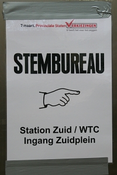

### Résultat des élections

{.left}
Hier, il y avait des élections. Je n'en ai pas parlé jusqu'à présent parce que la campagne était molle et la couverture médiatique beaucoup moins grande que pour les [législatives de novembre dernier](/apres-les-elections). Bien qu'ayant lieu dans tout le pays, il s'agissait des élections provinciales, scrutin où sont élus les membres des **États provinciaux** qui gèrent ensuite [chaque province des Pays-Bas](/les-provinces-des-pays-bas) avec le commisaire de la Reine, qui lui est nommé. Ces élus provinciaux sont aussi de grands électeurs qui élisent les sénateurs. Ces dernier ont un grand pouvoir sur tout nouveau projet de loi et ces élections peuvent donc avoir de grande concéquences politique si la majorité gouvernementale n'a pas la majorité au Sénat (*Eerste kamer*).

Comme toujours il est surprenant pour un français de voir une élection se dérouler en semaine. Dans ma boite peu de gens on manqué pour assurer leur devoir civique. Il faut dire que j'ai pas mal de collègues étranger et rappeller que ces élections n'interesse pas les foules. Le seul résultat que je peux vous donner pour le moment est la participation qui s'élève à 46,3 % des inscrits. Pour les résultats plus détaillés, je vous propose de surveiller [la page ad hoc de Wikipedia](http://fr.wikipedia.org/wiki/%C3%89lections_provinciales_n%C3%A9erlandaises_de_2007) qui saura évoluer avec les véritables chiffres. 

<!--excerpt-->

### Résultats du football

Autres résultats qui sont tombés hier, ceux du foot, de la *[Ligue des Champions](http://www.uefa.com/competitions/ucl/index.html)* pour être plus précis. De ce coté là, tout se passe plutôt bien (pour les Néerlandais). Hier soir, les joueurs du **PSV Eindhoven** ont tenu tête à l'équipe d'**Arsenal**. C'est pourtant pas évident de tenir tête à une équipe anglaise, **Lille OSC** en sait quelque chose et je pense que je n'ai pas besoin de vous donner le résultat de son match contre **Manchester United**. Coté français, il n'y a plus d'équipe en lice pour les quarts de finale. Coté Néerlandais, il y a encore le PSV.

<!-- HTML -->

<table align="center" style="border:1px solid black; background-color:white;">
<tr style="border:1px solid black;">
<th>Match</th>
<th>Pays</th>
<th>Club</th>
<th>Aller</th>
<th>Total</th>
<th>Retour</th>
<th>Club</th>
<th>Pays</th>

</tr>
<tr align="center">
<td>1</td>
<td>
</td>
<td> FC Porto</td>
<td>1-1</td>
<td>2-<b>3</b></td>
<td>1-<b>2</b></td>
<td bgcolor="#EAEAEA">
 Chelsea</td>

<td bgcolor="#EAEAEA"></td>
</tr>
<tr align="center">
<td>2</td>
<td></td>
<td> Celtic de Glasgow</td>
<td>0-0</td>
<td>0-<b>1</b></td>
<td>0-<b>1</b> (a.p.)</td>

<td bgcolor="#EAEAEA">
Milan AC</td>

<td bgcolor="#EAEAEA"></td>

</tr>
<tr align="center">
<td>3</td>
<td bgcolor="#EAEAEA"></td>
<td bgcolor="#EAEAEA"> PSV Eindhoven</td>
<td><b>1</b>-0</td>
<td><b>2</b>-1</td>

<td>1-1</td>
<td> Arsenal</td>

<td></td>
</tr>
<tr align="center">
<td>4</td>
<td></td>
<td>
Lille OSC</td>

<td>0-<b>1</b></td>

<td>0-<b>2</b></td>
<td>0-<b>1</b></td>
<td bgcolor="#EAEAEA">
Manchester United</td>

<td bgcolor="#EAEAEA"></td>
</tr>
<tr align="center">
<td>5</td>
<td bgcolor="#EAEAEA"></td>
<td bgcolor="#EAEAEA">
AS Rome</td> 

<td>0-0</td>
<td><b>2</b>-0</td>
<td><b>2</b>-0</td>
<td> Olympique Lyonnais</td>
<td></td> 
</tr> 
<tr align="center">
<td>6</td>
<td></td>

<td> FC Barcelone</td>
<td>1-<b>2</b></td>
<td>2-<b>2</b></td>
<td><b>1</b>-0</td>
<td bgcolor="#EAEAEA"> Liverpool FC</td>

<td bgcolor="#EAEAEA"></td>
</tr>

<tr align="center">
<td>7</td>
<td></td>
<td> Real Madrid</td>
<td><b>3</b>-2</td>
<td>4-<b>4</b></td>
<td>1-<b>2</b></td>
<td bgcolor="#EAEAEA"> Bayern de Munich</td>

<td bgcolor="#EAEAEA"></td>
</tr>
<tr align="center">
<td>8</td>
<td></td>
<td> Inter Milan</td>
<td>2-2</td>
<td>2-<b>2</b></td>
<td>0-0</td>
<td bgcolor="#EAEAEA"> Valence CF</td>

<td bgcolor="#EAEAEA"></td>
</tr>
</table>
<!-- / HTML -->
