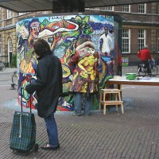
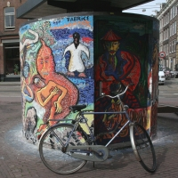

Je vous ai déjà parlé de [Marie Heinekenplein](/marie-heineken-est-fan-de-l-om), la place tout près de chez moi où je passe régulièrement pour faire les cours. Je ne vous ai pas parlé de Fabrice, un artiste peintre du quartier qui, lui aussi, doit faire ses courses à la superette sur Marie Heinekenplein.

Cette place ronde est ceinturée par un unique immeuble récent et les enfants qui jouent sur la place poussent des cris qui montent aux fenêtres des habitants. Cette immeuble de copropriété est un immeuble récent dominé par une tour de plus de 10 étages (à Amsterdam, les maisons font généralement 4 étages maximum). Il est bien agencé des appartements modernes, des ascenceurs et des caves pour tous mais le local des poubelles est situé devant l'immeuble juste devant la place forme un obstacle disgracieux aux passants.

Pour que cette verrue architecturale prenne un peu plus de couleurs, les copropriétaires ont demandé à un peintre du quartier, **Fabrice** de la décorer. Fabrice s'en est chargé, il a pris plusieurs semaine au mois d'avril 2006 pour réaliser une grande mosaïque colorée. Le local est rond, tout comme la place ; sa fresque propose donc, un tour du monde avec des personages de tous les continents, un mafioso, un manchot, un tigre, un esquimeau...

<!-- HTML -->
<table align=center cellpadding=3><tr><td align=center>
<!-- / HTML -->
[{.center}](http://flickr.com/photos/13274211@N00/425364778/)
**Fabrice devant sa mosaïque**  
[agrandir](http://flickr.com/photos/13274211@N00/425364778/)
<!-- HTML -->
</td><td align=center>
<!-- / HTML -->
[{.center}](http://flickr.com/photos/13274211@N00/425364784/)
**La fresque de Fabrice**  
[agrandir](http://flickr.com/photos/13274211@N00/425364784/)
<!-- HTML -->
</td></tr></table>
<!-- / HTML -->

Fabrice dessine toujours des personages de toutes les couleurs qui étirent leurs membres dans toutes les directions. Quand on le voit ?uvrer avec son manteau, on comprend très vite que c'est lui qui l'a peint. Il semble se fondre dans la fresque devant lui. Même s'il s'aggit ici d'une mosaïque, on reconnait son coup de pinceau...
---