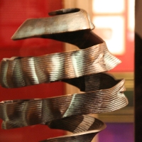

Tout le monde (ou presque) connait **MC Escher**, ses compositions infinies et ses gravures d'improbables mouvements perpetuels. Maurits Cornelis Escher un artiste néerlandais mort l'année de ma naissance et dont les travaux ne peuvent pas être qualifié de telle ou telle école artistique. En fait, on compare plutôt ses travaux à celui de musiciens lorsque ses compositions répétitives resemblent à des canons, ou au travail de matématiciens avec ses dessins de fractales et ces jeux avec le plan et l'espace.

MC Escher ne se réclamait pas particulièrement de mathématiciens ou de musiciens, mais il savait parler et faire parler de son travail. Aujourd'hui, sa famille continue de gérer son œuvre et d'en tirer profit grâce à la [M.C. Escher Foundation](http://www.mcescher.com/Foundation/foundation.htm) et la [M.C. Escher Company B.V](http://www.mcescher.com/MCECompany/MCECompany.htm) et moult [produits dérivés](http://www.worldofescher.com/) à succès.

[{.left}](http://www.flickr.com/photos/13274211@N00/423080182/)

<!--excerpt-->

MC Escher est né en **Frise**[^1], il a séjourné en **Italie** et en **Suisse** puis à Uccle en **Belgique** et enfin à Baan dans la province d'**Utrecht**[^2]. C'est pourtant à La Haye qu'on peut le retrouver le mieux aujourd'hui. On peut d'abbord admirer sa plus grande œuvre à la poste principale de la ville. [Metamorphosis III](http://en.wikipedia.org/wiki/Metamorphosis_III), toujours présente au bureau de poste de Kerkplein depuis 1968. Enfin c'est aussi à **La Haye** qu'un **musée Escher** ([Escher in het paleis](http://www.escherinhetpaleis.nl/)) ouvre ses portes au public en y montrant des gravures de l'artistes et des photos de ses lieux de vie. Le dernier étage propose aussi des activités en rapport avec les réalités improbables chères à l'artiste. C'est en allant là bas que J'ai pris en photo la sculpture ci-contre, inspirée de [cette gravure](http://www.mcescher.com/Gallery/recogn-bmp/LW401.jpg)

--- 
[^1]: Voir [Provinces des Pays-Bas](/les-provinces-des-pays-bas)
[^2]: Voir aussi [Provinces des Pays-Bas](/les-provinces-des-pays-bas)
<!-- post notes:
http://www.flickr.com/photos/alvy/337697526/
--->
