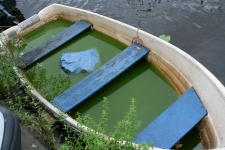
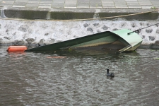
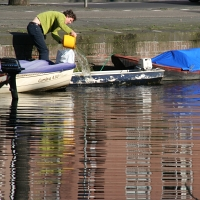

Amsterdam et ses canaux offre à ses habitants un nouveau mode de promenade, **la promenade sur l'eau**. Ces petites [sorties en bateau](/sortie-en-bateau) sont super agréables et quand, déhambulant sur les quais, piéton ou à vélo, on voit ces groupes avancer au fil de l'eau sous le soleil, on est pris de jalousie. On a envie d'acheter un petit bateau pour pouvoir faire comme eux, se promener sur les canaux d'Amsterdam quand on veut.

<!--excerpt-->

Un bon bateau coûte cher mais il est toujours possible d'acheter un embarcation plus petite genre barque. Cela semble très simple fait il ne faut pas oublier qu'**un bateau demande de l'entretien**. Il ne faut pas oublier le coup de peinture de temps en temps pour protéger le bois et le métal ainsi que les révisions mécaniques que réclamme tout moteur. Surtout, dans cette ville pluvieuse, une visite régulière à son embarcation s'impose, malgré la pose de bâches de protection, les bateaux se remplissent d'eau, s'enfoncent lentement jusqu'à couler.

<!-- HTML -->
<table border="0" align="center" cellpadding="3"><tr><td style="text-align:center;">

{.center}
**Bateau vaseux**
<!-- HTML -->
</td><td style="text-align:center;">

{.center}
**Bateau abandonné**
<!-- HTML -->
</td></tr></table>

Pour éviter cela, il n'y a qu'une solution. Si on tient à son bateau, on lui rend visite régulièrement, on vérifie si la bâche qui le protège est toujours bien attachée et s'il y a de l'eau dans le fond, **il faut écoper** (*Uithozen*)...

<!-- HTML -->
<table cellpading="5" border="0" align="center"><tr><td style="text-align:center;">

[{.center}](http://flickr.com/photos/13274211@N00/423970950/)
**Écopage**  
[agrandir](http://flickr.com/photos/13274211@N00/423970950/)
<!-- HTML -->
</td></tr></table>

