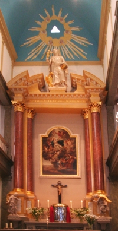

Voilà que nous entrons dans le Tridium Pascal[^1] et, après [un an de blog](/un-an-de-blog-a-amsterdam), je ne vous ai pas encore présenté ma paroisse. Les catholiques francophones d'Amsterdam ont la chance de pouvoir céleber la messe tous les dimanche dans leur langue natale. Évidement quand j'ai découvert ça [sur le site du consulat](http://www.consulfrance-amsterdam.org/article.php3?id_article=50), vu mon niveau de Néerlandais, j'ai décidé d'en profiter.

<!--excerpt-->

{.left} **Les messes on lieu tous les dimanches matin à 11h15** dans un lieu fort touristique du centre ville : [Le Béguinage](http://www.begijnhofamsterdam.nl/ ). La chapelle au centre de ce jardin est une paroisse anglicane et les messes y sont dites aussi en anglais. L'église catholique est dans une maison juste en face. C'est une ancienne église cachée[^2] mais un porche indique sa présence de façon ostensible. À l'intérieur, il n'y a aucun doute, on est vraiment dans une église, et richement décorée (dans un style qui n'est pas mon préféré mais je ne viens pas ici pour faire du tourisme). Les prètres qui célèbrent les messes sont des néerlandais du diocèse d'Amsterdam qui ont souvent été en mission en afrique. ceci explique leur maîtrise de ma langue.

Les paroissiens représentent bien la francophonie au sens large, il y a là, des **expatriés français**,  des **touristes** avec le guide du routard en guise de missel et aussi des **italiens** qui arrivent sûremment mieux à suivre la messe ici. Il y a aussi pas mal d'**africains** dont la présence donne du dynamisme à la communauté. D'ailleurs les premiers dimanche du mois, c'est la [chorale africaine](http://www.messecatholiqueamsterdam.org/chorale.html) qui anime la messe avec des chants en Susu, Lingala, Sango, Wolof, Zulu ou autre langue africaine. On troque notre francophonie pour des chants nouveau et péchus et notre harmonium pour des tam-tam.

Une communauté néerlandaise occupe habituellement cette église mais la communauté française y a aussi ses quartiers. Le presbytère sert de lieu de rencontre autour d'un café après la messe. Ce Tridium Pascal c'est l'occasion de mêler nos deux communautés pour un Jeudi Saint et une Vigile pascale commune et bilingue. Ça me rappelle [les rameaux](http://par.stgch.free.fr/vie_paroissiale/actua/rameaux.php) de [ma paroisse parisienne](http://par.stgch.free.fr/) avec les Croates d'en face. Sauf que je ne comprenais rien au Croate alors que je pense que les néerlandais arriveront eux, à suivre notre Français.

----

Voir aussi [La messe de Noël en français](/la-messe-de-noel-en-francais)

---
[^1]: Jeudi Saint, vendredi Saint et samedi Saint, les trois jours avant le dimanche de Pâques
[^2]: Jusqu'au XIXe, [le culte catholique était toléré](/catholiques-et-protestants) à condition de ne pas être visible. Les églises catholiques étaient donc cachées dans des maisons et on ne sonnait pas les cloches.