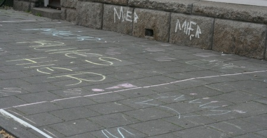

Dit trottoir is **BEZET** door *Alix* op Koninginnedag.

{.center}

Je pense qu'avec la phrase et la photo ci dessus, vous conprendrez que *bezet* signifie *réservé*. Lorsqu'on réserve une table dans un restaurant, il est souvent écrit *Gereserveered* sur la table. Mais apparement, les bouts de trottoirs réservés à la craie dans la rue pour pouvoir vendre toutes sortes de choses pendant la fête de la reine, le sont avec le mot **bezet**.

Durant *Koninginedag* (la fête de la reine), le commerce est autorisé pour tout le monde sans avoir bsoin de patente. Les trottoirs de toutes les villes des Pays-Bas se transforment alors en véritable brocante.

* voir aussi [Le guide de la fête de la reine](http://www.iamsterdam.com/visiting_exploring/culture/annual_cultural_0/queen's_day)
* [préparatifs en orange](/preparatifs-oranges)
