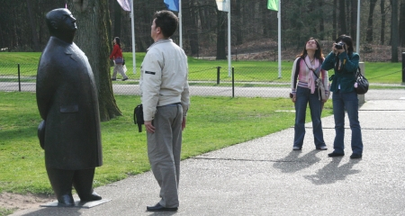
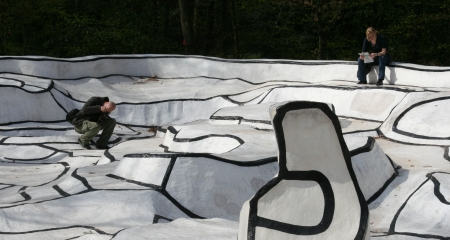

Voici un titre en néerlandais qui me permet de répondre à un post vieux d'un an ([Week end de Pâques à Paris](/week-end-de-paques-a-paris)) dont le succès récent montre que certaines personnes cherchent à occuper leur week end de pâques en cherchant sur Internet...

<!--excerpt-->

Pour leur week-end à Paris, je ne suis plus trop bien placé pour aider ces pauvres internautes mais je peux leur suggérer de passer leur week-end aux Pays-Bas et même leur donner des idées. Comme Ninamsterdam, il est possible de passer [son week-end en Zelande](http://ninamsterdam.canalblog.com/archives/2007/04/09/4572504.html). D'autres idées sont possibles, comme passer un dimanche à [Naarden](/naarden-c-etait-dimanche) ou à [Biesbosch](/dimanche-a-biesbosch), aller [en Frise](/zeilen-in-friesland) (*Friesland*)... Ce week end nous avons décidé d'aller au parc nationnal du **Hoge Veluwe** dans la province de Gueldre (*Gelderland*).

Le parc du Hoge Veluwe est connu pour ses dunes et sa faune. En fait il y a, au centre du pays, une zone qui est essenciellement formée de dunes et de sols sableux. Le sol de cette région n'étant pas riche, il est surement plus interessant d'y implanter un parc que de l'exploiter de manière agricole. En fait, ce parc a été crée en par **Anton et Hélène Kröller-Müller** comme partie intégrante de leur domaine pour y pratiquer la chasse créant ainsi le plus grand parc de dunes du nord-est de l'Europe. Les Kröller-Müller ont laissé leur emprunte dans le parc avec une maison de chasse crée par l'architecte Berlage et un musée qui aujourd'hui porte leur nom.

Aujourd'hui le domaine est un parc nationnal mais il est géré par une fondation. Contrairement aux autres parcs nationnaux, l'entrée y est payante (7€ à l'heure ou j'écris ces lignes) et le domaine est ceinturé par une clôture quelque peu controversée. La visite du parc est facilité par la mise à disposition gratuite de vélos blancs à l'entrée. Il est quand même possible de s'y promener à pied lorsqu'il n'y a plus de vélo à disposition comme cela nous est arrivé.

{.center}

D'après le dépliant, nous pouvons croiser **des mouflons corses** apportés là pour les parties de chasses des Kröller-Müller. Nous avons surtout croisé des touristes de tous horizons et des enfants qui cherchaient des œufs de pâques. Le **musée Kröller-Müller** à lui seul vaut le déplacement. Ce musée rassemble dans ses salles et son jardin de sculptures, de **grands chefs d'œuvres de l'art des 19e et 20e siècles**. C'est là que nous avons passé notre dimanche de pâques pour le plus grand plaisir des yeux.

{.center}

* voir [les Provinces des Pays-Bas](/les-provinces-des-pays-bas)
