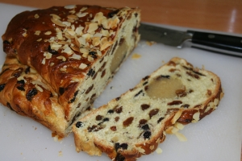

Pâques est aussi une fête aux Pays-Bas, le lundi de pâques est ferié et on l'appelle **deuxième jour de pâques** (*tweede paasdag*). C'est donc un week end ou les familles peuvent profiter des premiers jours de beau temps un peu plus longtemps.

Samedi soir je suis allé à [la vigile pascale](/bonne-fete-pascales) et j'ai appris à souhaiter joyeuses pâques en néerlandais: *Zalig pasen* ou un truc du genre... Le lendemain, nous sommes allés Au [Hoge Veluwe](/paasdagen-in-amsterdam) pour faire un peu de vélo dans la nature... J'ai aussi appris que *Zalig pasen* avait une connotation [religieuse](/catholiques-et-protestants) et que la façon laïque de souhaiter joyeuse pâque est *Prettige Paasdagen*. Voilà à nouveau une séquelle de [la pillerisation](/nouveau-mot-verzuiling) où chaque communauté a ses propres codes.

{.left}

<!--excerpt-->

## Les cloches
En parlant de codes et de traditions, voici les traditions néerlandaises à pâques, comme en Allemagne et au Royaume-Uni, ce ne sont pas les cloches qui cachent les oeufs dans la nature mais de sont [des lapins](http://www.nieuwnieuws.nl/archives/2007/04/kinderen_kunnen_konijnen_lease.html). En fait, les cloches avaient prévu de passer mais en rentrant de Rome, elles sont passées par la France; elles ont trouvé ça si bien qu'elles se sont arrêtées là. Les autres pays, plus au nord ont donc eu recourt à des intérimaires, des lapins pour livrer les oeufs.

## La bouffe
Autre tradition interessante pour les babines: **le Paasstol** C'est une sorte de pain (voir photo ci-contre) de pâques et comme c'est un pain de fête; il y a plein de bonnes choses dedans, des raisons secs; de la pâte d'amande, des fruits confits, des bouts d'amande... bref; c'est un véritable gâteau qu'on peut apprécier en dessert.
