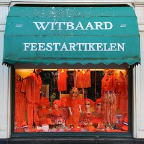

[{.left}](http://flickr.com/photos/13274211@N00/457422197/) Cette année la fête de la reine (*Konninginnedag*) ne tombe pas un week end, elle ne sera donc pas décalée et nous aurons droit à un vrai jour ferié qui prolonge le week end (**lundi 30 avril**). Cela fait déjà des mois que les gens se préparent à cette fête nationale. Ici une vitrine de déguisements tous oranges le rappelle aux passants. Les organisateurs louent leurs bateaux et les visiteurs essayent de planifier leurs balades.

Cette année la Reine effectuera sa visite dans la ville brabançonne de *Den Bosch*. Là bas aussi les préparatifs doivent aller de bon train avec pose de fanions et de barières dans les rues. À Amsterdam aussi les préparations de la dernière semaine seront de plus en plus visibles. Nous alons voir fleurir des lignes tracées sur les trottoirs pour [réserver des emplacements](/nouveau-mot-bezet) de brocante. En effet, la fête de la reine est aussi un vide-grenier géant et chacun peut vendre ce qu'il veut dans la rue sans payer de patente.

**Pour rappel**

* [Koninginnedag (la fête de la reine)](/koninginnedag)
* [Quelques panoramiques](/pas-de-fete-du-travail)
* [Après koninginnedag](/apres-koninginnedag)
* [Ma collection de chapeaux](/hoeden), plein de photos

* voir aussi [Le guide de la fête de la reine](http://www.iamsterdam.com/visiting_exploring/culture/annual_cultural_0/queen's_day)
