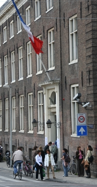
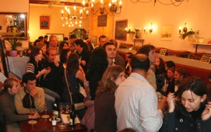

{.left} C'est un petit dimanche que je ne voulais pas passer sur les routes en allant voter à Paris. J'ai donc donné procuration et je suis resté ici pour voir si les conseils que j'avais donné [pour voter aux Pays-Bas](/pour-voter-aux-pays-bas) servaient à quelque chose...

Une petite visite au consulat m'a permis de constater que, ici aussi, les bureaux de vote étaient pleins de monde. Le consul *himself* s'occupait du bureau numéro 1. A la sortie, quelques gens qui discutent et une fille qui distribue des tracts publicitaires en français... Le monde attendu est là. Il parraît que les français de l'étranger ont plus voté que d'habitude mais il l'abstention, à 57%, reste importante. Les Pays-Bas n'échappent pas à la règle, l'abstention y est même plus grande que la moyenne des français de l'étranger.

<!--excerpt-->

Après le scrutin les français s'étaient donnés plusieurs rendez-vous. [Amsterdam](http://www.leforum.nl/phpBB/viewtopic.php?t=9268&postdays=0&postorder=asc&start=0), [Den Haag](http://www.leforum.nl/phpBB/viewtopic.php?t=9239&start=0&postdays=0&postorder=asc&highlight=), [Rotterdam](http://www.leforum.nl/phpBB/viewtopic.php?t=9187). Pour la première fois il y avait un rendez-vous dans [un QG typique](http://www.leforum.nl/phpBB/viewtopic.php?t=9311). La crêperie bretonne *Bon Appétit* sur [Albert Cuyp](/albert-cuyp-le-marche) près de chez nous était bondé de gens rivés sur un petit écran avec les images de [TV5MONDE](http://tv5.org/TV5Site/elections2007/). Il y avait là des gens de tout bords et l'ambiance était bonne même si les royalistes étaient un peu tristes.

{.center}

<!-- HTML -->
 
<!-- / HTML -->

## Résultats du vote des français aux Pays-Bas

**inscrits:** 10055  
**votants:** 4165 soit **41,4%** de participation, soit presque un point de plus qu'au premier tour   
**suffrages exprimés:** 4066

**Ségolène Royal** : 2429 voix soit **59,7%** 

**Nicolas Sarkozy** : 1637 voix soit **40,3%**

source: [Ministère des affaires étrangères](http://www.diplomatie.gouv.fr/fr/IMG/pdf/MAE_Resultats_2eme_tour.pdf)
