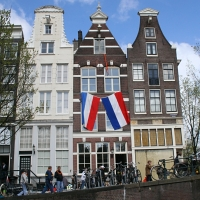
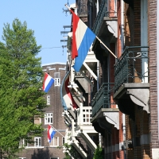

Depuis quelques jours, le drapeau Néerlandais (*Prinsenvlag*) est fièrement arboré aux fenêtres des maisons, une tradition qu'on ne voit peu en France. 

À Amsterdam, beaucoup de maisons ont des porte-drapeaux vissés au mur, ces derniers ne sont pas fixé pour rien parce que les habitants y plantent de temps en temps le drapeau national. Par ces beaux jours de printemps les couleurs du pays flottent ainsi à de nombreuses fenêtres. À la campagne, certaines maison ont même un mât dans le jardin pour hisser ces mêmes couleurs. On pourrait croire que les Néerlandais sont de grands vexillologues, que nenni, ils ne hissent que leur drapeau nationnal.

## Histoire du drapeau

Je ne vais pas m'attarder là dessus, [Ninamsterdam](http://ninamsterdam.canalblog.com/archives/2007/01/12/3665779.html) l'explique très bien comme ça.

## Les raisons de le sortir

**La fête de la reine** (*Konininedag*) d'abbord, le **30 avril** est la fête nationale. En plus du orange, les habitants sortent parfois des drapeaux. Les couleurs du drapeau sont d'ailleurs parfois repris dans l'habillement. On peut noter quand même certain drapeaux sont accrochés avec un oriflamme orange, couleur de la maison royale.

**Le jour du souvenir** (*Dodenherdenking*), hier, **4 mai**, j'ai été surpris de voir à nouveau tant de drapeaux aux fenêtres. En fait tous ces drapeaux étaient en berne. Le jour du souvenir est dédié aux soldats morts durant la deuxième guerre mondiale. Depuis 1961 ce souvenir est élargit à tous les soldats Néerlandais morts à la guerre ( Liban, Bosnie...). La reine dépose traditionnelement une gèrbe au pied du monument national sur Dam.

**La libération** (*Bevrijdingsdag*) arrive le lendemain **5 mai**. Les drapeaux en berne sont relevés et l'hommage aux morts laissent la place aux réjouissances d'avoir gagné la guerre. Il parrait même que c'est un jour ferié mais je ne peut pas le constater un samedi...

<!-- HTML -->
<table align=center><tr><td>
<!-- / HTML -->
{.center}
<!-- HTML -->
</td><td>
<!-- / HTML -->
{.center}
<!-- HTML -->
</td></tr></table>
<!-- / HTML -->
---