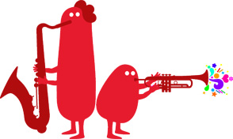

Comme partout, le 21 juin est le jour de **la fête de la musique**. On pourrait croire que cette généralité s'applique à Amsterdam aussi et bien c'est vrai. Demain, une série de concerts est organisée **dans le pijp** (mon quartier). Le [site web de l'évènement](http://www.feestdermuziek.nl/) annonce un riche programme dont je pourrais peut être vous rendre compte bientôt.

Cette fête qui est d'origine française (*Jack Lang en 1981 et tout ça...*) s'est répendue dans le monde mais jusqu'à présent elle n'a jamais eu lieu à Amsterdam. Et comme la fête est d'origine française, c'est le cas ici sachant que c'est [Laurent Chambon](/kreukreuscopie) qui a défendu l'idée en mairie ([il l'explique ici](http://laurentchambon.blogspot.com/2006/12/la-fte-de-la-musique-australovicienne.html)) et qui a commencé à faire avancer le projet. Ce dernier a aujourd'hui quitté l'organisation avec d'autres estiment que la fête était récupérée. ([il s'explique ici](http://laurentchambon.blogspot.com/2007/05/un-vnement-sans-lgitimit.html)). D'autres continuent. Demain, il y aura des chouettes concerts et le reste importe guère et j'espère que ça se passera bien. Je vais allez voir la scène organisée par Sophie-Marie à [Marie-Heinekenplein](/marie-et-fabrice) et peut-être faire un tour à d'autres endroits...

Pour le logo de la fête, Laurent a quand même réussi a dégoter une super graphiste qui a dessiné les couvertures de plein de CD que j'ai à la maison. En effet, c'est **Geneviève Gauckler**, la désigneuse de F-com, qui a pondu les afiches et ce logo:

{.center}

### **[Les photos sont visibles ici](/feest-der-muziek-photos)**
