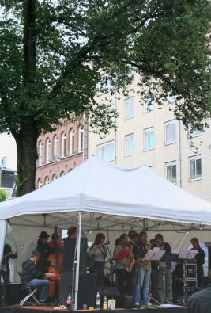
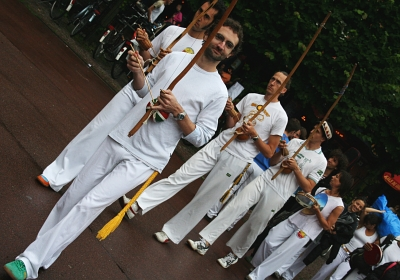
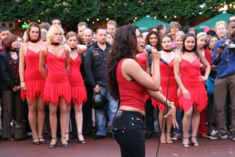
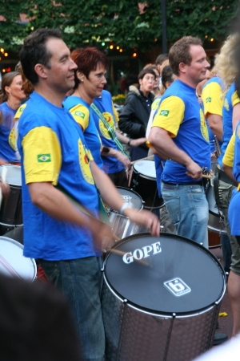
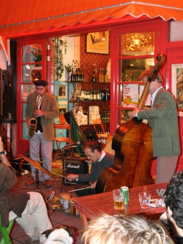

Je n'ai pas trop le temps d'écrire un long article sur ma soirée d'hier, voici quelques photos de moments choisis de la fête de la musique 2007 à Amsterdam. Ce fut une petite première avec la pluie comme invitée d'honneur. Les concerts étaient quand même bien sympa.

  
la scène ouverte *Jazz*

  
Capoeristes

  
Danseuses salsa du Cantinero

  
Unidos de *precus brésiliennes* de Amsterdam

  
Boeuf dans un troquet
---