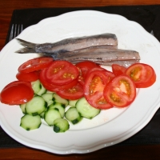
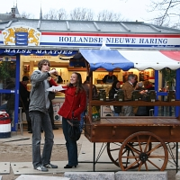

Il serait peut être temps de tenir [les promesses](/de-hollandse-nieuwe-haring) que j'ai faites juste avant les élections législatives en France...

Voici donc quelques photos de hareng et de hollandais...

<!-- HTML -->
<table align=center cellpadding=3><tr><td align=center>
<!-- / HTML -->
  
**Baraque de hollandse nieuwe**
<!-- HTML -->
</td><td align=center>
<!-- / HTML -->
  
**Des hareng en entrée**
<!-- HTML -->
</td></tr></table>
<!-- / HTML -->

<!-- HTML -->
<table align=center cellpadding=3><tr><td align=center>
<!-- / HTML -->
  
**Hollandse nieuwe en superette**  
 
<!-- HTML -->
</td><td align=center>
<!-- / HTML -->
  
**Harengs pour le goûter**  
([agrandir](http://www.flickr.com/photos/13274211@N00/542053717/ ))
<!-- HTML -->
</td></tr></table>
<!-- / HTML -->

* [De Hollandse Nieuwe Haring (intro)](/de-hollandse-nieuwe-haring)
* [De Hollandse Nieuwe (histoire)](/de-hollandse-nieuwe-histoire)
---