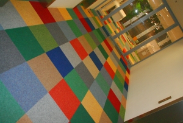

Quand je vous ai présenté [mon nouveau boulot](/de-mon-boulot), je vous disais :
> En vrac, je vais surement vous parler un jour de [WTC Zuid](/station-zuid-wtc-devient-amsterdam-zuid), des horaires de travail, de [la cantine](/le-lunch-du-midi) et de la couleur de la moquette dans les couloirs...

Voici venu le temps de vous parler de la moquette, pas celle qu'on fume mais celle qu'on foule des pieds à l'entrée des bureaux de ma boîte, **la moquette d'Elmer** (*kamerbreed van Elmer*). 

[{.left}](/public/images/photos/2007-06/moquette_8219-600.jpg)
Pas de grand discours, la photo devrait suffire pour vous présenter ce qui me rappelle parfois la déco de chez ma sœur Clotilde. 

L'inspiration **David Mc Kee** est flagrante non ? Vous ne connaissez pas David Mc Kee, l'Auteur d'[Elmer l'éléphant](http://www.ibookdb.net/book/37056/2211019447) ? [Le site de son éditeur](http://www.randomhouse.co.uk/childrens/elmer/home.htm) devrait vous en apprendre plus.
