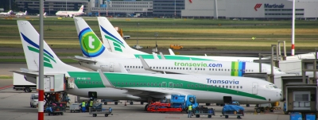

Ce week end nous sommes allés sur la côte d'Azur. Pour ce faire, nous avons pris des e-tickets ''billets d'avion sans papier'' sur le site de **[Transavia](http://www.transavia.com/)**. Beaucoup de vols de la compagnie low cost Néerlandaise sont au départ des aéroports de Rotterdam et Eindowen mais heureusement, les vols pour Nice-côte-d'Azur sont au départ de Schiphol, l'aéroport d'Amsterdam, le plus proche de la maison.

En fait de *low cost*, les prix des billets sont comparables à  ceux pratiqués par KLM sur cette même ligne. Seulement quelques petits euros de moins. Pour ce prix, il n'y a bien sûr pas de collation dans l'avion ni d'excuses en cas de retard. Pour le reste **transavia.com** me semble une compagnie efficace avec des avions modernes et un personnel compétant. 

Les publicités sur les panneaux en ville vantent pourtant des tarifs bien *low-cost* pour des destinations précises comme Pau ou Calvi que le site web vend rapidement avec des hotels et des trasports au sol. Tout ce qui fait une compagnie à bon marché. À la différence que cette compagnie bon marché est une filiale de KLM, du groupe Air France-KLM qui semblait il y a peu souffrir de la concurence de ces compagnies *bon marché*. Aujourd'hui le groupe essaye, avec l'expérience de transavia.com, de mettre en place des vols à bas coût pour les destination de vacances des Néerlandais.

{.center}
<!-- HTML -->

ancien et nouveau logos transavia à Schiphol

<!-- / HTML -->

**Transavia n'a pas toujours été cette compagnie que je décris aujourd'hui**. Elle existe depuis 1966 et c'était au départ une compagnie Limburgeoise qui opérait au départ de Maastricht. Très vite la compagnie se spécialise dans les vols charters avec sa filialle **Basiq air** à destinations du sud de l'Europe, là ou les Néerlandais vont en vacances. KLM achète 80% des parts de Transavia en 1991. La compagnie tente de **changer d'image en 2000** en adoptant les régles des compagnies bon marché. Elle devient transavia.com mais conserve ses destinations de vacances. KLM rachète les 20% restants de transavia.com en 2003, juste avant de se faire absorber par Air France.

Lire aussi 
* [Hier en Fokker](/hier-en-fokker)
* [Pas hier, pas en Fokker](/pas-hier-pas-en-fokker)
* [Les avions de la KLM ont tous des petits noms](/voyage-klm-retour)
* [Les Vliegtuigspotters de Schiphol](/vliegtuigspotters)
---
<!-- post notes:
http://www.toerkoop.nl/site/index/page=office_newsitem/id=211
--->
