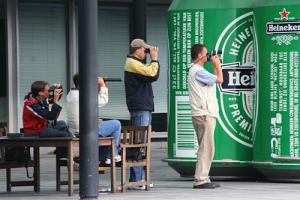
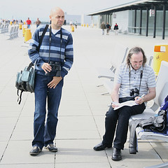
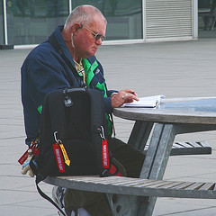

Je suis passé **à Schiphol** (l'aéroport d'Amsterdam) samedi matin pour voir un ami qui passait à Amsterdam pour rentrer chez lui à Ouagadougou. J'ai profité du voyage pour aller regarder les navions sur **la terrasse panoramique**. Il n'y a pas de pareille terrasse dans les aéroports parisiens de triste mémoire (la terrasse d'Orly est fermée suite à l'attaque d'un avion au lance-roquette le 13 janvier 1975) alors il faut que j'en profite.

{.center}

La terrasse est très fréquenté et à ma grande surprise il y a surtout des plane spotters. Moi qui voulais **prendre des avions en photo**, je vous présente aujourd'hui ceux qui les regardent à longueur de journée tous les week end. Les plane spotters (*vliegtuigspotters*) néerlandais sont gâtés pour effectuer leur activité favorite. Ils ont de [nombreux points d'observation](http://www.schipholview.nl/index_spotinfo.html) autour de l'aéroport pour voir se poser les avions et pour les voir décoller. Il peuvent ainsi noter sur leur petit carnet et avec exactitude le moment le train d'atterissage touche le sol ou la seconde ou les roues s'escamotent dans les ailes. (voir [ce reportage](http://www.blablablog.nl/B1038127581/C2137970906/E1521887349/index.html))

La terrasse de l'aéroport est un beau lieu de rencontre pour ces *vliegtuigspotters* qui peuvent parler de leur passion commune entre aéronotique et anecdotes.  Certains travaillent à plusieurs pour relire les horaires qu'ils ont eu sur internet et pendre des photos en même temps. Les photos sont parfois mises en commun sur Internet sur des sites généraux comme [flickr](http://www.flickr.com/groups/28713840@N00/pool/), [msn](http://groups.msn.com/spottersprikbord) ou des forums spécialisés comme [dutchplanespotters](http://www.dutchplanespotters.nl/). J'ai vu un autre plus solitaire, il arrivait à prendre ses notes sans même regarder les avions, il ne faisait qu'écouter [la radio de la tour de controle](http://www.schipholview.nl/index_frequencies.html), prenait ses notes et se levait de temps en temps pour prendre des photos.

<!-- HTML -->

<!-- / HTML -->
[{.center}](http://www.flickr.com/photos/13274211@N00/561290914/)  
Ceux là ont des jumelles des longue-vues, des appareils photos et tous les horaires des avions de la journée qu'ils annotent consciencieusement.
<!-- HTML -->

<!-- / HTML -->

<!-- HTML -->

<!-- / HTML -->
[{.center}](http://www.flickr.com/photos/13274211@N00/561299904/)  
Celui-ci a un poste de radio branché sur la fréquence de la tour de contrôle et un sac décoré avec des porte-clés **Remove before flight**_, le signe de reconnaissance des mordus d'aéronotique.
<!-- HTML -->

<!-- / HTML -->

L'aéroport de Schiphol lance aujourd'hui [une grande enquète](http://www.blikopnieuws.nl/bericht/51455) en direction de ces *anoraks* de l'aéronotique. L'aéroport souhaiterait aménager des endroits pour que ces spotters puisse continuer de vivre leur passion sans géner les riverains ni les accès aux aéroports.

### voir aussi
Moi aussi j'ai pris des avions en photo :
* [Des Boeing 737 de KLM](/voyage-klm-retour)
* [Un Fokker de KLM cityhopper](/hier-en-fokker)
---