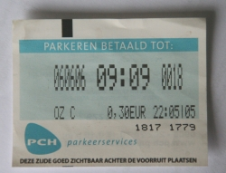

Je ne savais pas comment vous présenter le prix du [stationnement dans les rue d'Amsterdam](/a-amsterdam-se-garer-coute-cher). Je voulais vous montrer ce joli ticket datant de l'année dernière.

{.center}

Je ne savais pas quand vous raconter que dans mon quartier, pour gérer le stationnement, la mairie a fait appel à une société privée: [PCH](http://www.pch-parkeerservices.nl/index.php) alors que dans le reste de la ville, le stationnement est géré par [Stadtoezicht](http://www.stadstoezicht.amsterdam.nl), un service municipal dédié. Ce choix s'est fait à l'époque où la municipalité *Oud Zuid* était gérée par le VVD.

Ce ticket indique 6/6/6, date marquante à 09h09, heure marquante. Ce jour là, j'étais à Amsterdam, aujourd'hui, le 7/7/7, autre date marquante, je suis encore à Amsterdam. Vous souvenez-vous de ce que vous faites à ces dates marquantes ?
