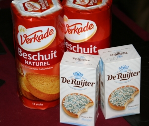
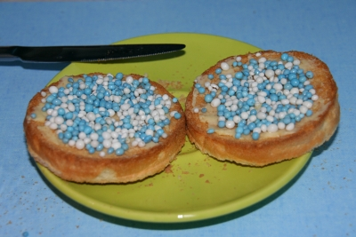

Le week-end dernier nous sommes allé en France pour voir la famille. Dans la tournée des grands ducs, il y avait aussi une étape à Paris pour voir mon neveux Benjamin le cadet, nouveau né de ma belle famille. Pour fêter les naissances, les Néerlandais ont, là aussi, des traditions culinaires peu communes. Ils mangent des *beschuit* et des *muisjes*.

<!--excerpt-->

## prononcez beschuit en muisjes
{.right}
Écris comme ça, c'es mots ne sont pas impressionnants mais il faut surtout les entendre (Il faut dire **bêssrhrheuüït'** et **meuüïscheusse**) pour comprendre que ce sont vraiment des spécialités du pays. J'ai d'ailleurs du beaucoup tourné dans la proxima-supérette parce qu'à l'oral comme à l'écrit, je ne connaissais pas ces produits. Les *muisjes* sont de petites miettes de sucre anisé (près des confitures) de que l'on étale sur des biscottes rondes, les *beschuits* (vendus au rayon biscottes). *Muisjes* signifie en fait petite souris à cause sûrement de leur structure ressemblant aux crottes de souris.

## fêter la naissance d'un enfant
Les *muisjes* s'étalent délicatement sur une *beschuit* préalablement beurée pour faciliter l'adhérence des petites crottes. Cette spécialité de friandise est traditionnellement mangée à l'occasion de naissances. On dit que ça porte bonheur. À l'origine les *muisjes* n'étaient que roses mais depuis le début des années 1990, il existe des *muisjes* bleues plus adaptées pour fêter la naissance d'un garçon. Aujourd'hui il y a même des *muisjes* oranges pour les occasions royales.

{.center}

Muisjes sur des beschuit

---