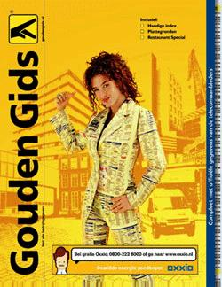

Je vous ai déjà dit que j'étais dans l'annuaire local (**gouden gids**) et qu'il était [bon marché de me téléphoner de France](/appellez-moi-gratuitement) (gratuit) sur ce numéro de téléphone fixe. Il semble que le listage pratique de mon numéro soit surtout utilisé par des autochtones.

{.center}

*Si vous voulez en savoir plus sur la couverture de cette annuaire, lisez [Katja Shuurmann, la cover girl des pages jaunes](/Katja-Shuurmann-cover-girl-pages-jaunes)*.

<!--excerpt-->

## Dit is een verkeersing
Je reçois de nombreux coups de fils dont je ne comprends pas toujours la teneur. après quelques secondes d'apprentissage des sonorités locales je demande brièvement *sprekt u engels ?*. La réponse de mon interlocuteur varie entre *Yes* et *No* en passant par *A little* et *Wat zegt u?!*. La plupart du temps ces appels dont des démarchages télémarketing et sont rapidement éconduits par mon incapacité à m'exprimer en Néerlandais. Parfois je reçois des appels de mains tremblotantes dont les bras s'excusent platement du bout des lèvres. Faux numéro *Dit is een verkeerd nummer*.

## Nouveau mot : *verzekering begrafenissen*
Hier soir j'ai reçu un appel d'une démarcheuse Néerlandaise qui voulait bien me parler en anglais. Elle a commencé à me vanter son produit d'assurance obsèques, *funeral insurance* qui doit se dire aussi *verzekering begrafenissen*.

## Les rendez-vous du dimanche
Une fois j'ai eu le bonheur de recevoir un coup de fil vraiment utile. Il y a 10 jours, après une sortie dominicale au **Frans Hals Museum de Haarlem**, je reçois un appel d'une personne me demandant si j'étais bien moi et si je prenais le tram à Amsterdam. J'avais perdu ma carte de transport à Haarlem et un jeune homme l'ayant trouvé, a cherché mon nom dans *gouden gids* pour me proposer de me la remettre **en main propre à Amsterdam**. 

Rendez-vous fut pris à la gare centrale où je pus constater que je ne ressemblais pas tant que ça à ma photo... Le jeune homme, très sympa a même refusé toute récompense m'expliquant qu'**il aimerait qu'on fasse de même si un jour on trouve ses affaires**.

Promis je ferrais de même... et je décide aussi de rester dans les pages jaunes.
