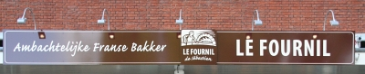
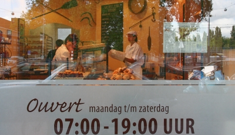

Une boulangerie Française a ouvert ses portes à Amsterdam. Il fallait que j'y aille.

{.center}

L'ouverture de cette boulangerie a déjà été **annoncée par le presse nationale** en page 6 du Financieele Dagblad ainsi que sur le forum des Hollandais et semble remporter un succès mérité. J'ai donc pris mon vélo un matin pour passer au fournil de Sébastien à Olympiaplein 119, juste [avant d'aller travailler](/de-mon-boulot) (puisque c'est sur ma route).

<!--excerpt-->

**La femme du boulanger** m'a confirmé que c'était elle qui m'avait [laissé un message](/le-lunch-du-midi#co) en mars pour me dire qu'une boulangerie allait ouvrir dans le sud d'Amsterdam. Depuis le début de l'année, le couple prépare l'installation de cette boulangerie française. Le résultat s'offrait à mes yeux, une file de clients défilaient devant des jolis pains et des viennoiseries appétissants et variés. La boulangère et ses employés servaient les clients en néerlandais jusqu'à ce que je demande mon pain au chocolat matinal en français. À coté de la boutique, le fournil donne lui aussi sur la rue. Une grande enseigne chapotte les deux vitrines (tout comme cet article) et affiche *Ambachtelijke franse bakker* ce que je traduirait par **Boulangerie artisanale française**.

J'ai souvent eu à me plaindre de **la qualité du pain par ici**. près de chez moi, une boulangerie (*Bakker met passie*) propose des baguettes pas mauvaises au prix du caviar. Il y a moins cher ailleurs mais j'ai parfois l'impression que leur pain est une sorte de pain-de-mie mou en forme de baguette. L'artisan boulanger français, lui, connait son métier, la bagette que j'ai acheté ce jour là m'a bien plu. J'y retournerais. Et pour ne pas oublier les horaires d'ouverture, je vais les noter ci-dessous.

{.center}

