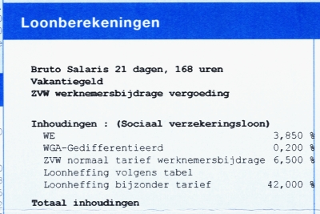

En cette fin de mois de juin, j'ai reçu ma feuille de salaire (*Salarisspecificatie*) comme tous les mois. Sur cette dernière figurait une surprise attendue : l'ajout d'une ligne suplémentaire au doux nom de *Vakantiegeld*. Petit cours de vocabulaire : *geld* signifie **argent** (les [distributeurs de billets](/choisir-une-banque) s'appellent *Gerldautomaat*) et *vakantie* signifie **vacances**.

La traduction ainsi faite, vous devinez aiséement qu'il s'agit d'agent pour les vacances. Ce **pécule de vacances** (*Vakantiegeld*) est calculé au mois de mai et versé au mois de juin. Il doit représenter 8%  du salaire annuel brut. Je ne sais pas si c'est un versement obligatoire dans ma branche ou ci c'est dans le code du travail des Pays-Bas mais voilà presque un treizième mois que la société est tenue de me verser pour que je puisse aller en vacances.

{.center}

On a vu que les Néerlandais [partaient beaucoup en vacances](/millions-de-neerlandais) et c'est peut être là l'une des raisons pour lesquelles on voit tant de Néerlandais partout pendant les vacances.
