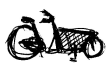

Après vous avoir présenté la seule équipe Néerlandaise du tour, je vais vous présenter un Néerlandais, fan de vélo qui fait le tour à sa manière.

Ceux qui lisent les commentaires de mes posts ont du voir celui de Thover sur mon [histoire du Thalys](/une-nouvelle-ligne-a-grande-vitesse). Thover est un Néerlandais (Thomas Vergouwen) qui vit à Paris et il est donc, lui aussi, concerné par le Thalys. Comme moi, il parle de ses expériences d'étranger dans une autre capitale européenne dans un blog : [paris.thover.com](http://paris.thover.com) et répète à l'envi qu'il n'est pas *Hollandais* mais *Néerlandais*...

[<!-- TODO: Add image alt -->{.left}|http://www.orangedansletour.com/]
Ce mois de juiller le blog habituel de Thomas n'est pas très vivant mais ce dernier nous donne rendez-vous sur un autre blog, le [blog Orange dans le Tour](http://www.orangedansletour.com/). Orange, dernier opérateur mobile néerlandais mais premier opérateur mobile français, participe à la caravane publicitaire du tour et propose aux joueurs de téléphoner avec des téléphones orange. Orange vit ainsi le tour de l'intérieur et prends assez facilement connaissance des potins et des petites histoires qu'on ne voit pas dans les journaux télé.

Thomas a bien de la chance, il bosse et il voit du (mon) pays en même temps.

<!-- HTML -->

<a href="/plein-de-velos-hollandais" title="tout savoir sur la bicyclette aux Pays-Bas">
<!-- / HTML -->
**Plein de vélos hollandais**  
{.center}  
1) Les avantages  
<!-- HTML -->
</a>

<!-- / HTML -->

<!-- HTML -->

<a href="/plein-de-velos" title="tout savoir sur la bicyclette aux Pays-Bas">
<!-- / HTML -->
**Plein de vélos hollandais**  
{.center}  
2) Les styles
<!-- HTML -->
</a>

<!-- / HTML -->

<!-- HTML -->

<a href="/plein-de-velos-hollandais-3" title="tout savoir sur la bicyclette aux Pays-Bas">
<!-- / HTML -->
**Plein de vélos hollandais**  
{.center}  
3) Les marques
<!-- HTML -->
</a>

<!-- / HTML -->

<!-- HTML -->

<a href="/plein-de-velos-pas-hollandais-4" title="tout savoir sur la bicyclette aux Pays-Bas">
<!-- / HTML -->
**Plein de vélos hollandais**  
{.center}  
4) Les marques étrangères
<!-- HTML -->
</a>

<!-- / HTML -->

<!-- HTML -->

<a href="/une-heure-sans-velo" title="tout savoir sur la bicyclette aux Pays-Bas">
<!-- / HTML -->
**Plein de vélos hollandais**  
{.center}  
5) Parking à vélos
<!-- HTML -->
</a>

<!-- / HTML -->

<!-- HTML -->

<a href="/les-velos-de-location" title="tout savoir sur la bicyclette aux Pays-Bas">
<!-- / HTML -->
**Plein de vélos hollandais**  
{.center}  
6) Vélos de location
<!-- HTML -->
</a>

<!-- / HTML -->

<!-- HTML -->

<!-- / HTML -->
---