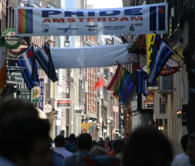

La parade de la *gay en lesbian pride* a eu lieu le premier week end d'août. C'est une grosse fête et ce n'est pas passé inaperçu. [Ninamsterdam](http://ninamsterdam.canalblog.com/archives/2007/08/05/5817044.html) et la [revue de presse de l'Ambassade](/je-lis-deja-les-journaux/) ont couvert l'évènement et Kreukreuscopie a parlé de [quelques préparatifs](http://laurentchambon.blogspot.com/2007/07/bateau-htro-la-pride-damsterdam.html). De mon coté, pas de compte-rendu parce que je n'ai pas pu regarder passer la parade à cause d'obligations beaucoup moins plaisantes. Sur la route, l'autoradio nous précisait 350 000 personnes selon la police et 500 000 selon les organisateurs. Comme d'habitude, l'auditeur se fait sa petite moyenne pour se rendre compte qu'il y avait beaucoup de monde. La parade de la gay pride se déroule sur les canaux et à Amsterdam c'est l'une des plus grosse animation de la ville avec la [fête de la reine](/tag/koninginnedag/).

{.center}

Dimanche soir en me promenant dans Amsterdam, j'ai constaté qu'il y avait effectivement beaucoup de monde. On était venu de toute l'Europe pour faire la fête et aussi soutenir les revendications des associations gays et lesbiennes. La presse s'est récemment fait l'écho de l'augmentation des violences à l'encontre des pédés à Amsterdam. Dans cette ville réputée pour sa tolérance ça craint. Amsterdam fut la première ville a ériger [un monument](http://members.chello.nl/mennevellinga/homomonument.html) à la mémoire des déportés sexuels durant la seconde guerre mondiale c'est aussi la première ville, fidèle à sa tradition d'accueil et de tolérance, à avoir entendu les revendications des homos. Durant les discours qui ponctuaient la journée, le président du COC[^1] rendait hommage à **Schelto Patijn**, ancien maire d'Amsterdam, mort il y a quelque mois qui avait à son époque soutenu l'organisation de la première gay pride à Amsterdam.

J'en rajoute dans [Amsterdam, capitale gay](/Amsterdam-capitale-gay/)

---
[^1]: le [COC](http://nl.wikipedia.org/wiki/COC) est, il me semble la première association d'activistes gays du pays