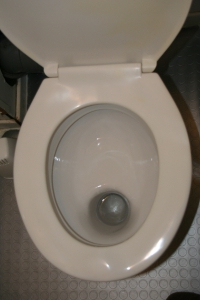

Il est souvent difficile de décrire la langue néerlandaise. Certains disent que le hollandais est **un mélange d'anglais et d'allemand**, que les hollandais n'ont pas su choisir entre l'une des deux langues et qu'ils ont finalement créé la leur, qui sonne entre les deux. C'est peut être vrai. C'est peut être aussi entre l'anglais et l'allemand que s'organise la société néerlandaise. En tout cas, une chose est sûre, pour ce qui est des WC, ils sont bien entre les deux.

L'exemple que je vais vous montrer est tout proche de moi puisque ce sont les **WC de la maison**. J'ai visité beaucoup d'appartements avant d'arriver en ville et nombre d'entre eux, même s'ils faisaient moins de 100 m² possédaient deux toilettes. Finalement, nous avons décider de louer un appartement qui lui aussi avait deux toilettes. Comme cet appart' était sur deux étages ce peut sembler logique et finalement c'est même plutôt pratique, surtout les soirs où l'on boit beaucoup de bière...

Mais revenons à nos Néerlandais qui ne savent pas choisir entre la culture anglaise et la culture allemande. Quand on parle de toilettes, je ne sais pas si tout le monde connait les WC à l'anglaise et les WC à l'allemande mais les deux modèles sont différents. Ce ne sont pas des WC à la turque, il y a bien un siège avec une lunette percée mais le mode de collecte est différent sur les WC à l'anglaise et les WC à l'allemande. Les photos ci-dessous vous expliqueront la différence.

Mon propriétaire, en bon hollandais n'a pas su choisir entre les deux. En bas, il a fait poser des WC à l'allemande alors qu'à l'étage, il a fait poser des WC à l'anglaise. Tout comme il faut, entre les deux...

<!-- HTML -->

<table align="center"><tr><td>
<!-- / HTML -->

  
**WC à l'anglaise**  
les fèces tombent directement dans le trou  
il y a risque d'éclaboussures
<!-- HTML -->
</td><td>
<!-- / HTML -->
  
**WC à l'allemande**  
les fèces tombent à l'arrière du trou  
il n'y a pas risque d'éclaboussures mais un problème d'odeurs

<!-- HTML -->
</td></tr></table>

<!-- / HTML -->

voir aussi  
* [Pour se soulager (1)](/pour-se-soulager-1)
* [Pour se soulager (2)](/pour-se-soulager-2)
* [Pour se soulager (3)](/pour-se-soulager-3)
* [Pour se soulager (5)](/pour-se-soulager-5)
---