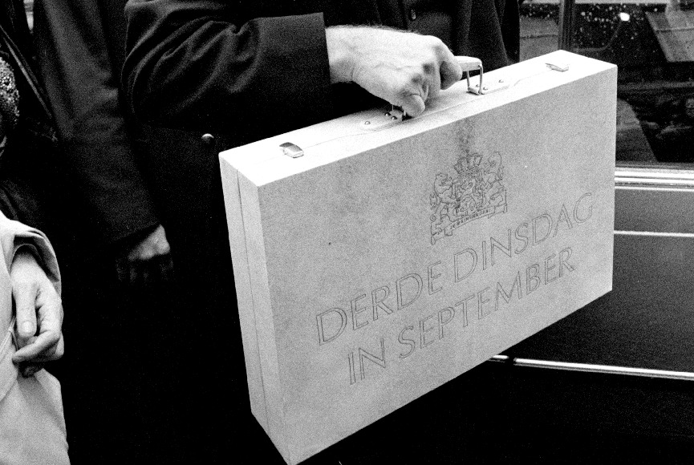

{.center}

Ceux qui suivent ce blog, savent bien ce que représente le troisime mardi de septembre aux Pays-Bas. J'ai expliqué l'année dernière que ce jour était [le jour du Prinsjesdag](/le-jour-du-prinsjesdag), la journée très protocolaire de présentation du budget. L'année dernière je regardais tranquilement la diffusion de cet évènement à la télé. **Gerrit Zalm** le libéral du VVD se balladait dans les rues avec sa valise en bois et la reine a fait un discours dans une salle ou toutes les femmes participaient au concours du plus beau chapeau.

Cette année beaucoup de choses ont changé...

<!--excerpt-->

J'ai trouvé [un boulot](/mon-nouveau-boulot-3) et je ne peux plus regarder la télé en journée. Il y a eu [des élections](/apres-les-elections) et un nouveau gouvernement a été formé. Le ministre qui se promène dans les rues aujourd'hui avec sa valise *Derde Dinsdag in September* est **Wouter Bos**, du parti travailliste. Cette année, contrairement à l'année dernière, un résumé du discours a été présenté aux députés et à la presse avant que la reine et le Ministre des finances ne fasse son discours. Il faut dire que nous ne sommes plus en période d'élection et le gouvernement a donc moins à craindre des critiques en un jour médiatique comme aujourd'hui.

Il reste que les femmes, comme tous les ans se réunissent pour exposer leurs plus beau chapeaux à la télé pendant que la reine prononce son discours.

Il me reste une une seule chose à vous livrer que je ne vous ai pas donné l'année dernière c'est [le site officiel de l'évènement](http://70.86.115.242/). Bonne lecture et à l'année prochaine...
