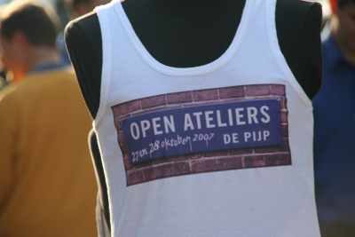

## Nouveau mot: autovrij zondag

Ce dimanche c'était *autovrij zondag*, un [dimanche sans auto à Amsterdam](http://amsterdam.nl/vrije_tijd_toerisme/evenementen/evenementen?ActItmIdt=40342). Pour l'occasion, les transports publics étaient gratuits et certaines rues étaient réservées aux piétons. L'accès à la ville était fermée depuis [le ring|]. Ça n'a pas empèché certains de prendre la voirture mais dans l'ensemble, l'opération a bien été suivie et les gens se sont déplacés à pied, en tram, à vélo, en bateau ou en famille. Il faut dire qu'il n'a jamais été demandé à Amsterdam de s'adapter à la voiture. Il n'y a donc pas besoin d'oppération comme celle là pour que les habitants se rendent compte que les alternatives à l'automobile sont parfois plus intéressantes. Ce dimanche sans voiture qui clos la semaine européenne de la mobilité est une façon médiatique de le rappeller. ([voir le site de l'opération](http://www.autovrijedag.amsterdam.nl/live/main.asp))

## Pijp en fête

L'*autovrij zondag*, a été aussi l'occasion d'organiser quelques manifestations dans la ville. Le Pijp, mon quartier, n'est pas en reste puisque la rue du marché Albert Cuyp, habituellement vide le dimanche était aussi animée qu'en semaine, les jours de marché. Pas moins de trois scènes différents ont proposé des programmes musicaux variés (country, folk, world) et de nombreux stands d'associations locales proposaient au public des activités plus ou moins interessantes.

## Rendez-vous demain

Il y avait aussi des artistes du coin qui proposaient leurs productions et rappelaient que la semaine suivantes ils recevraient les visiteurs dans leurs ateliers. En effet, les 27 et 28 octobre prochain, les artistes du quartier ouvrent les portes de leurs ateliers. Encore une occasion de sortir. Cette fois il est possible de venir en voiture mais il est toujours aussi peu évident de se garer. hélas, les transports en commun seront redevenus payants.
([voir le site de l'opération](http://openateliersdepijp.nl/))

{.center}

## Le festival off
Juste à coté de la rue Albert Cuyp, la rue Gerard Doustraat était elle aussi interdite aux voitures. Ces dernières étaient remplacées par un embouteillage de tables bien garnies sur plusieurs centaines de metres. Le [restaurant turc Saray](http://www.sarayrestaurant.nl/) fêtait ses 30 ans  (*30-jarig jubileum*) dans une ambiance de quartier sans égale. La fête a continué très tard et je regrette vrai,ent de ne pas vous en montrer une seule photo. Ce sera peut-être pour les 40 ans...
---