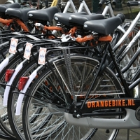
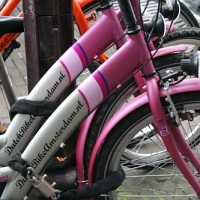
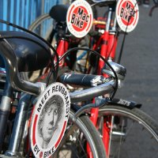
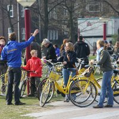

La mode commence au printemps, avec les beaux jours de drôle de cyclistes font leur apparition dans la ville aux cyclistes. Ces derniers se déplacent en bande serrée, ils ne savent jamais où ils vont tourner et utilisent leur sonnettes juste pour dire qu'ils sont contents et s'interpellent dans des dialectes à consonnance latine, japonaise où anglaise. Ce  sont les touristes avec leurs [vélos](/?q=v%C3%A9los) de location. Leur trajectoire est tellement imprévisible qu'on les accusent de passer n'importe-où en oubliant un peu facilement que le cycliste autochtone, lui aussi passe n'importe-où.

En plus de leur comportement, les touristes à vélo sont reconnaissables à leur monture estampillée *vélo de location*. Dans le genre, les vélos [Mac bike](http://www.macbike.nl/) sont les plus reconnaissable avec leur étiquette ronde sur le devant. En 2006, les loueurs de ces vélos se trimbalaient dans la ville avec le portrait du plus célèbre de ses peintres. Les autres loueurs de vélos transforment aussi les touristes en hommes sandwich en affichant l'adresse de leur site web sur leur cadre neuf. [dutchbikeamsterdam.nl](http://www.dutchbikeamsterdam.nl/) [orangebike.nl](http://www.orangebike.nl/) insitent ainsi les touristes à pédaler et ceux qui les regarde à surfer.

<!-- HTML -->
<table align=center cellpadding=3><tr><td align=center>
<!-- / HTML -->
  
**Orangebike.nl**  
<!-- HTML -->
</td><td align=center>
<!-- / HTML -->

  
**DutchBikeAmsterdam.nl**  
<!-- HTML -->
</td></tr>
<tr><td align=center>
<!-- / HTML -->
  
**Mac bike**  
[agrandir](http://flickr.com/photos/13274211@N00/892268153/)
<!-- HTML -->
</td><td align=center>
<!-- / HTML -->
  
**Yellow bikes**  
[agrandir](http://flickr.com/photos/13274211@N00/466333769/)
<!-- HTML -->
</td></tr>
</table>
<!-- / HTML -->

Les vélos de location les plus redoutés des pietons sont les [Yellow bikes](http://www.yellowbike.nl/). La location de ces vélos s'accompagne de visite guidée de la ville. Orangebike propose aussi des visites guidées de la ville mais je n'ai encore jamais été renversé par l'une de leurs bicyclettes.
