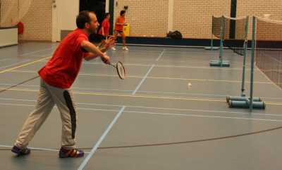
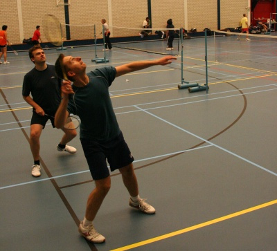
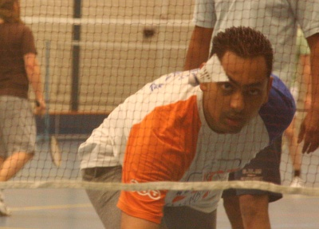

Septembre, c'est la rentrée pour presque tout le monde. Je n'échappe pas à la règle puisque j'ai repris [le boulot](/mon-nouveau-boulot-3) le 3.

Pour ce qui est des activités extra-scolaires, je fais toujours du Badminton et la saison de [Evening Badminton](http://britsoc.nl/main/show_page/14) de la [British Society](http://britsoc.nl/) vient de reprendre. Tous les mercredi soir, deux terrains sont réservés par la *BritSoc* dans un gymnase près de la maison. Les sept autres terrains sont occupés par un club local, des gens sympa mais vraiment trop bons pour nous...

{.center}

<!--excerpt-->

Cette activité de la British Society n'est pas réservée aux seuls *British*. Cette année nous avons vu arriver deux japonaises et un Australien. J'espère que les francophones ne manqueront pas à l'appel. L'année dernière, nous avons pu régulièrement faire des matchs **en français** ce qui est plus pratique pour --contester-- surveiller celui qui compte les points...

Francophones qui lisez ce blog, n'hésitez pas à vous inscrire, c'est Laura, une collègue, qui se charge des inscriptions.

''Voici maintenant quelques photos d'hier soir...''

{.center}

{.center}
