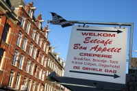

Après les vancaces, le frigo était vide. Alors samedi dernier nous avons fait quelques courses pour remplir le frigo. Il est toujours difficile pour un français de trouver de la bonne bouffe pour son frigo. Mais à force de tourner dans Amsterdam, on commence à trouver de bonnes adresses bien françaises. En voici quelques unes que nous avons visitées samedi.

<!--excerpt-->

## Du bœuf coupé à la française
Direction [Albert Cuyp](/albert-cuyp-le-marche), le marché. Au début de cette rue, se trouve **Alain Bernard, Franse Slagerij**. La [grande enseigne](http://www.krachtveld.com/portfolio_alain_gevelbord.htm) blanche au dessus de la vitrine en ment pas, le maître boucher est français, les garçons-bouchers sont hollandais mais ils savent très bien ce qu'ils vendent. La charcuterie n'ets pas faite maison mais elle est très bonne et vient de France. La rosette qui pend au dessus du comptoir fait forcément envie. Je peux aussi vous conseiller ces *franse-arabische* saucisses qu'on appelle aussi *merques*. Ce samedi, il n'y avait plus de bavette mais il restait de l'onglet. Et je crois bien que c'est là la seule boucherie qui nous demande si on veut notre onglet coupé à la française...

## Deux crèpes pour la route
{.right}
Toujours sur Albert Cuyp, l'après-midi avançait et il commençait à faire un peu faim. Nous sommes donc allé au **Bon Appétit**, cette crèperie bretonne juste à coté du restaurant Bazaar. Cette crèperie est un QG français [les soirs délections](/encore-un-dimanche-d-elections) mais aussi certain samedi après-midi où le garçon passe toutes ses commandes dans la langue de Molière...

## Du bon pain bien de chez nous
Après tout celà, il m'a fallu enfourcher [mon vélo de chez Décathlon](/un-b-twin-a-amsterdam) pour aller chercher le pain. Du bon pain, pour laller avec la bonne rosette. [Le fournil de Sébastien](/le-fournil-de-sebastien) est **la boulangerie française d'Amsterdam**. Après quelques mois d'ouverture, le succès ne faiblit pas et il y a la queue à toute heure de la journée. Dans la boutique, c'est l'effervescence devant tant de bons produits et à l'arrière, devant le fournil, il y a autant d'agitation pour sortir les baguettes que tout Amsterdam veut. La baguette de Sébastien va très bien avec la rosette d'Alain.  
[www.lefournil.nl](http://www.lefournil.nl/)

De retour à la maison, nous avons regardé le rugby sur TV5. Finalement, mon intégration dans ce pays se passe pas si mal... Je me demande ce que je vais faire ce samedi...
