La construction de la ligne de métro Nord-Sud (*Noordzuidlijn*) dure depuis des années. Les gens attendent leurs nouvelles stations et les rues sont toujours en travaux. Le sud de la Vijzelstraat, près de Weteringcicuit est coupée dans la longueur par une énorme tranchée qui gène les riverains depuis au moins 2005. Ces pauvres riverains subissent le bruit et les nuisances toute la journée, c'est surement pour ça qu'on a décider de leur offrir un peu d'évasion.

Les palissades du chantier sont maintenant le support de **cartes postales géantes** qui envoient des poutous de partout à ceux qui passent devant ce qui sera un jour le métro. La plupart des cartes postales viennent des Pays-Bas mais il y en a quelques unes de l'étranger dont une de Bar-sur-Aube accrochée juste devant le [Consulat de France](/carte-inutile). Je ne veux pas croire qu'il ne s’agit que d'une coïncidence.

Cette exposition en plein air a commencé au début de l'été mais comme c'était les vacances, je n'en parle qu'aux premiers frimas ce qui ne vous empêche pas d'aller la voir puisqu'elle n'a toujours pas été décrochée. Pour ceux qui habitent loin, je ne pense pas que ce soit une raison suffisante pour venir à Amsterdam. Je vous en diffuse donc quelques unes pour que vous non plus vous ne ratiez pas cette expo en plein air.

<!--excerpt-->

**Callantsoog**

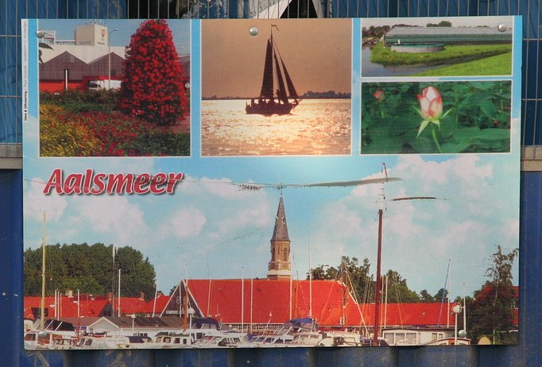
**Aalsmeer**  

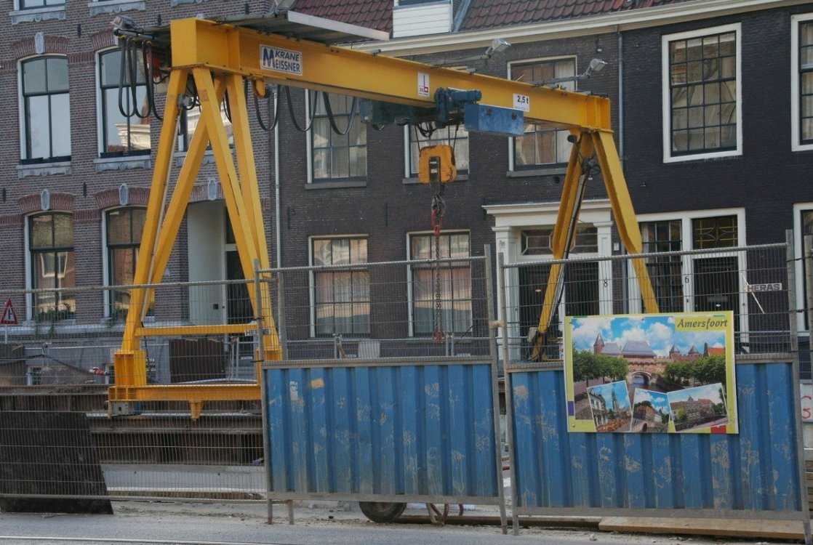
**Amersfoort**

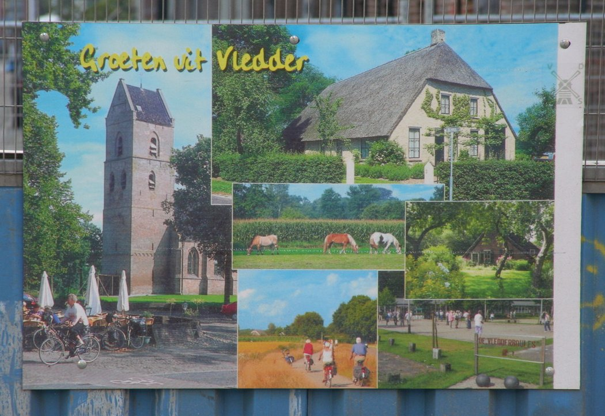
**Viedder**  

**Vlieland**  

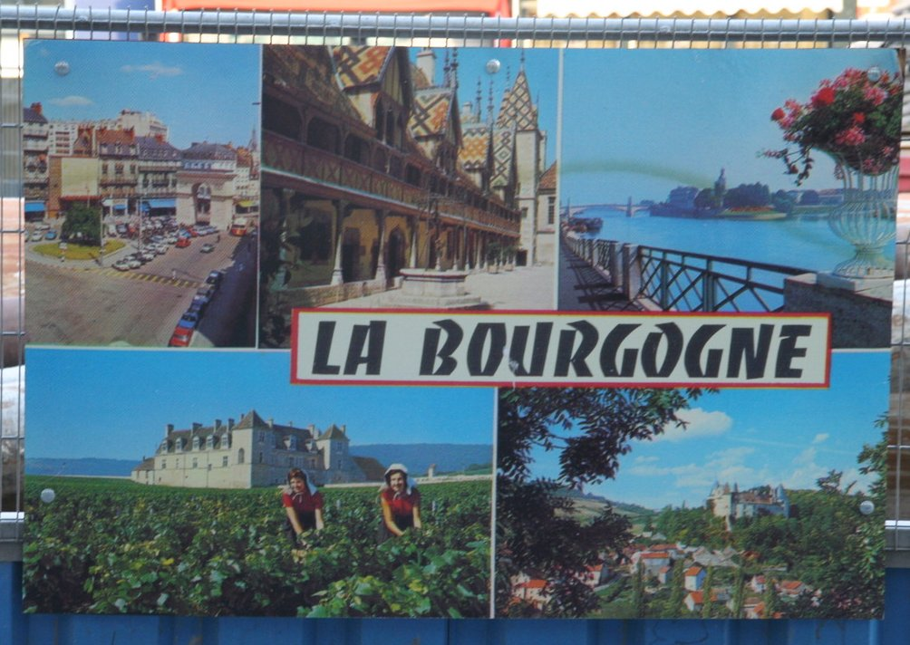
**La Bourgogne**  

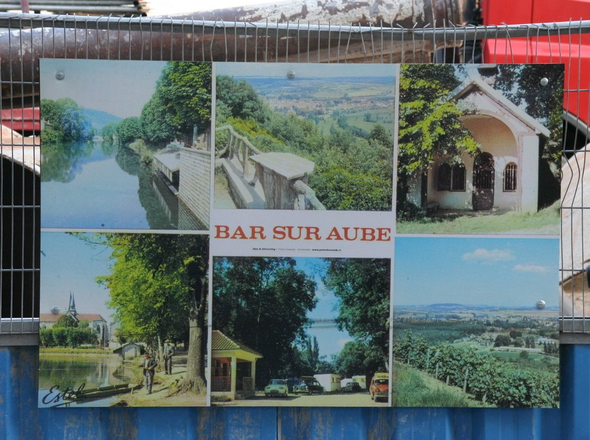
**Bar-sur-Aube**  

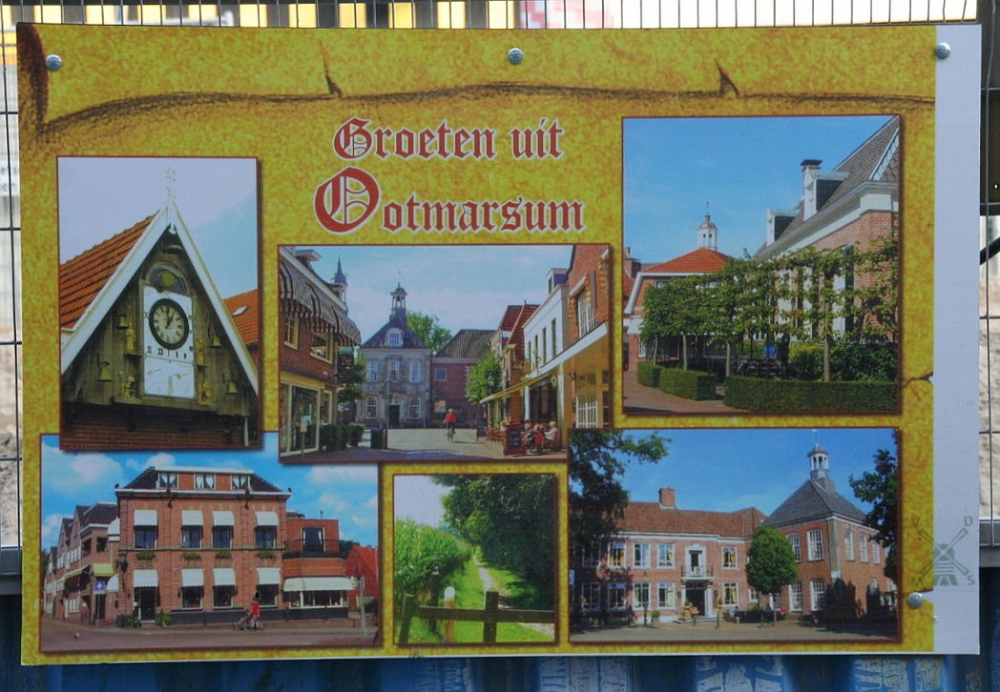
**Ootmarsum** 

**Makkum**  

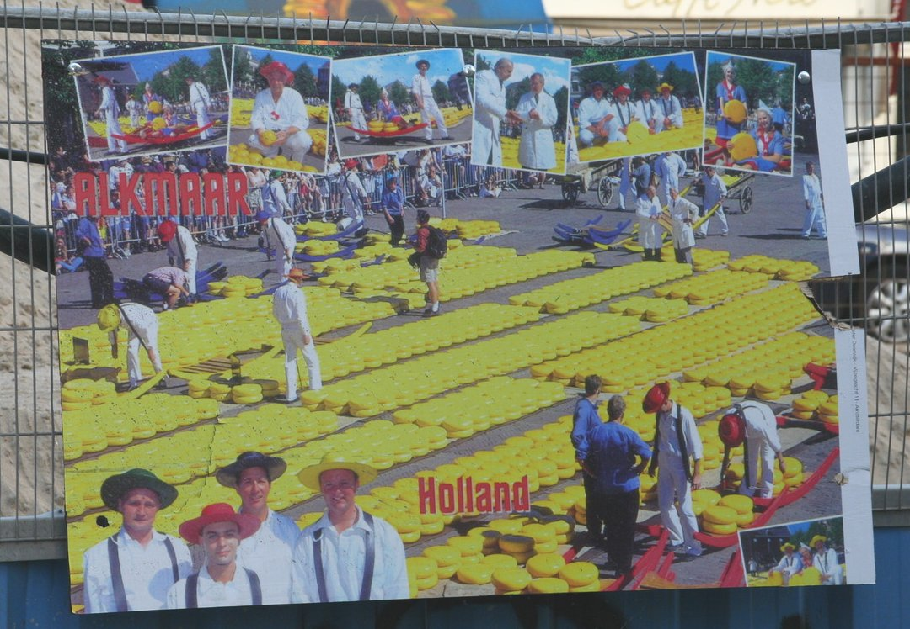
**Alkmaar**

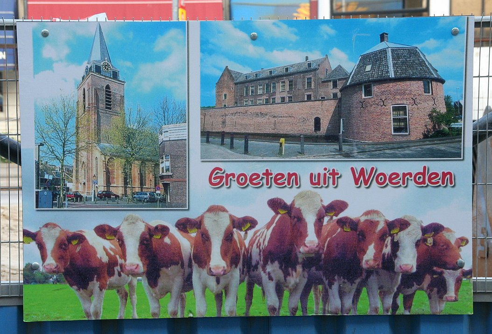
**Woerden**  

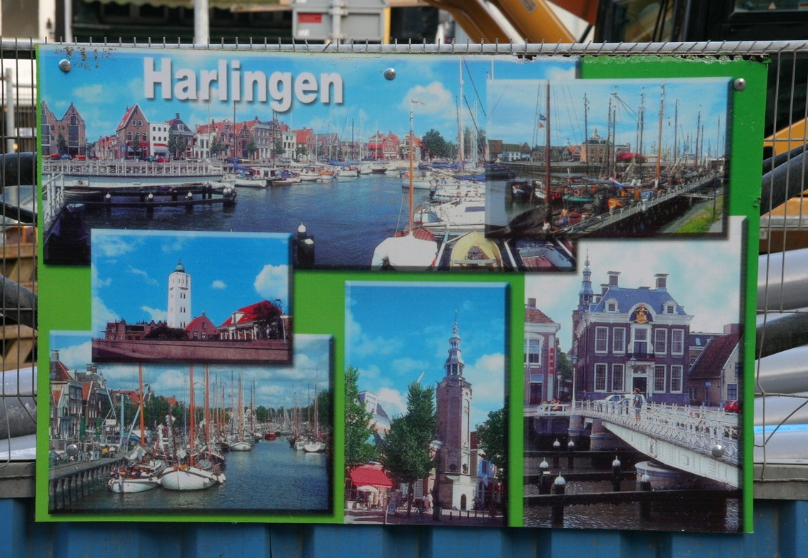
**Harlingen** 

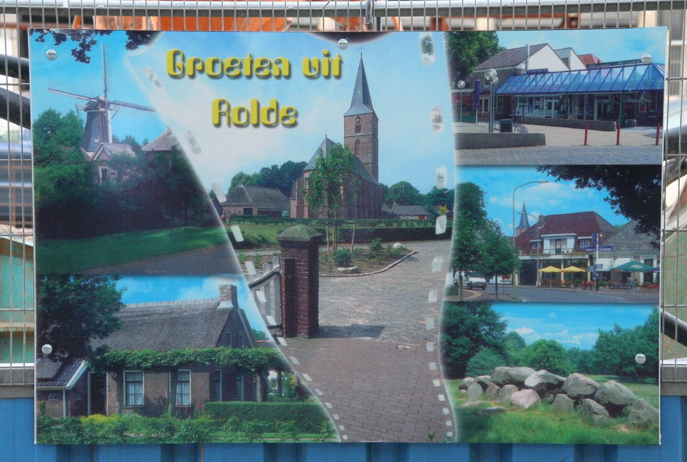
**Valkenburg**  

**Rolde** 

**Kerkrade** 

**Frislân (Friesland)** 
(La Frise)

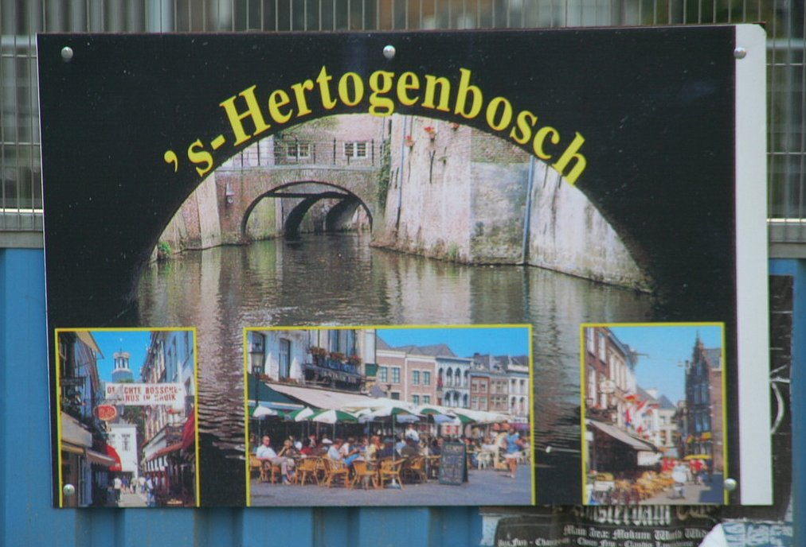
**s' Hechtogebosch (Den Bosch)**  
(Bois le Duc)

**Groningen**   
(Groningue)

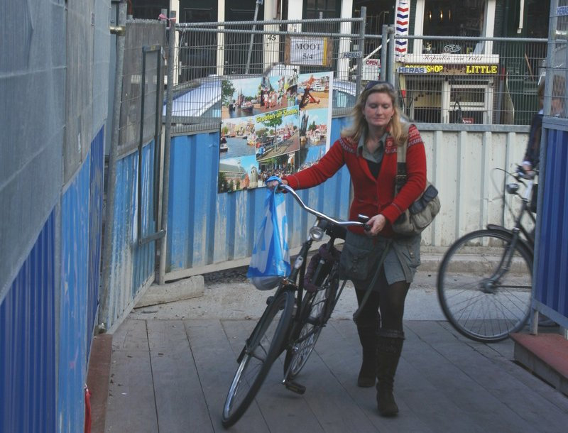
**Sneek** 

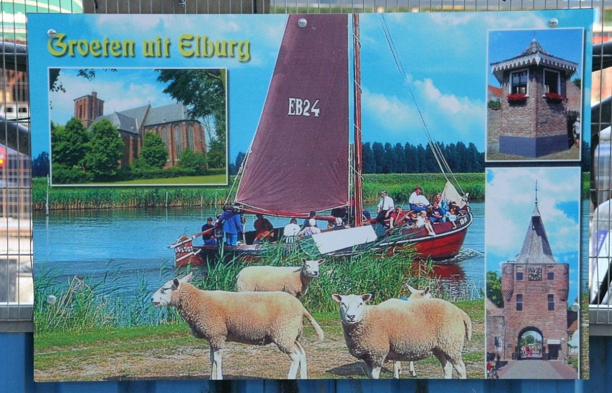
**Elburg**  

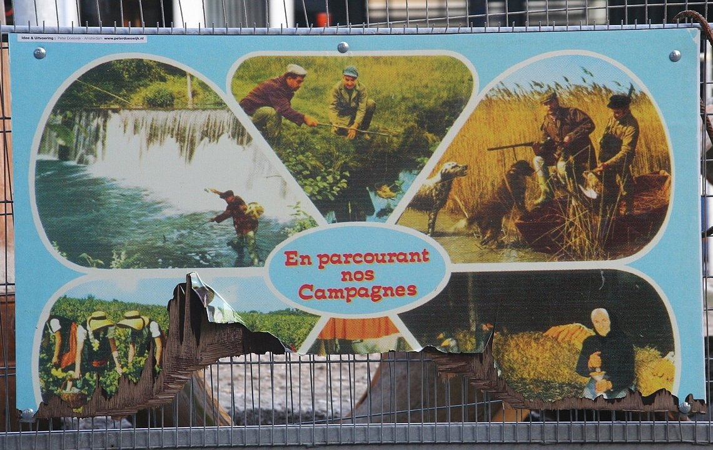
***Dans nos campagnes...*** 

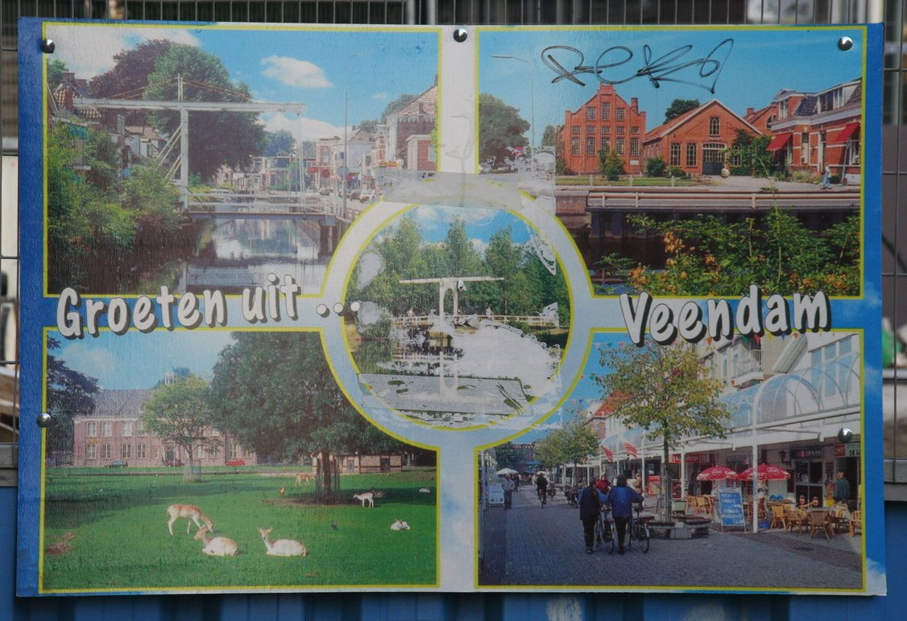
**Veendam** 

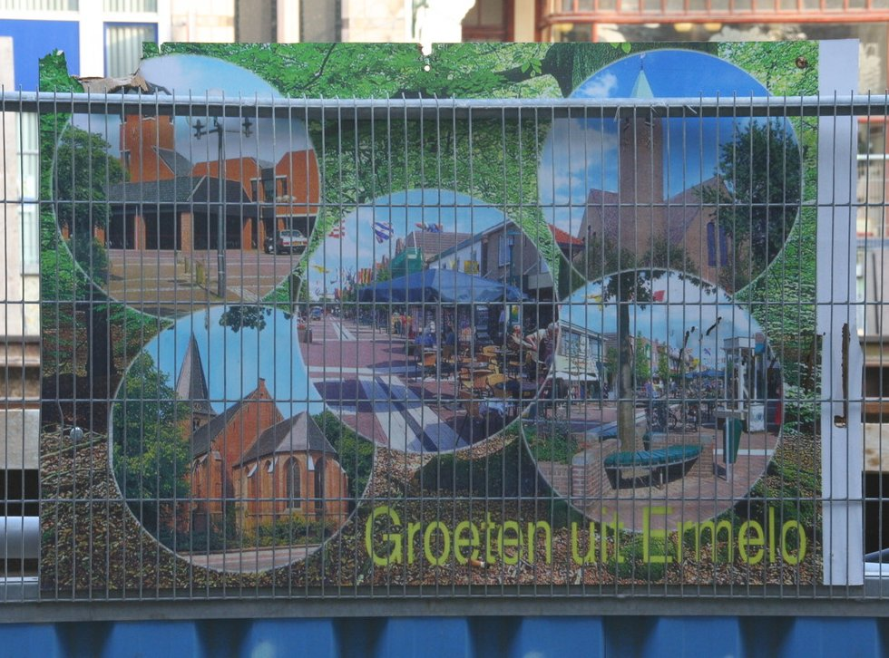
**Ermelo** 

**Zeist** 

