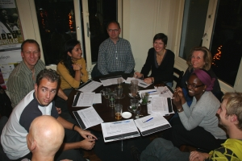

C'est vraiment la rentrée, après [le boulot](/mon-nouveau-boulot-3) et [le badminton](/reprise-du-badminton), c'est au tour du **Jaren**. Ce mot a beau être écrit en gras, il est mérite surement des explications.

## Nouveau mot : De Jaren
De Jaren pourrait se traduire par **les années**. Une année se dit *jaar* et plusieurs années se dit *jaren*. Si vous voulez savoir ce qu'est devenu le deuxième **a** dans ce pluriel, merci de revenir plus tard sur ce blog ou j'expiquerais peut être un jour les subtilités de cette langue...

**de jaren** est [un café - restaurant](http://www.diningcity.com/ams/dejaren/), un de ces *cafés blancs* d'Amsterdam où le design, les grands espaces et la lumière contraste avec la rusticité des cafés bruns.

## Mais de quelle reprise s'aggit-il ?
Devant votre empressement, je vais vous expliquer ce que j'appelle Jaren. Un mardi sur deux, des français d'Amsterdam et des Amstelodamois francophiles se réunissent dans un café pour converser **dans la langue de l'autre** autour d'un article de journal. Un échange sympatique qui nous permet de progresser si on a suffisement de bases. Pour ma part mes bases sont limitées, je ne sais pas si je progresse beaucoup mais c'est toujours une bonne occasion pour boire une bière. Le café dans lequel nous nous réunissons, c'est justement *de jaren*, il a donné son nom à nos réunions.

{.center}
