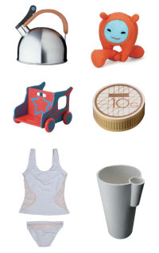

{.left}
Hier soir il y avait une [soirée promo chez HEMA](http://img.yourzine.nl/hema/1/docs/VriendenkoopavondToegang.pdf). -20% sur tout. Et quand on dit tout, c'est tout. HEMA est sûrement le seul magasin aux Pays-Bas vendant de la peinture à proximité des patisseries. Je vous ai déjà parlé de cette chaîne qui aujourd'hui appartient à [un fond de capital-investissement anglais](/les-petites-courses-de-l-ete). **Les magasins HEMA** sont connus pour vendre des produits utiles et de qualité sous en marque de distributeur. 
 
<!--excerpt-->

Ce que j'ai oublié de vous dire à ce moment là, c'est la réputation de cette enseigne pour ses produits originaux et jolis. Cette réputation est entretenue par un concours annuel de design. Les gagnants de ce concours retrouvent leurs inventions produites et commercialisées dans la chaîne de magasin. Ainsi, la marque donne sa chance à des jeunes designeurs et reste ainsi toujours à la pointe.

Les résulats de ce concours de design sont disponibles dans les deux langues sur le site [ontwerpwedstrijd](http://www.ontwerpwedstrijd.com/index.asp). HEMA a eu la bonne idée d'implanter des magasins en Belgique ce qui fait que sa cmmunication ainsi que la plupart de ses produits sont vendus dans les deux langues (Français et Hollandais).

* [voir brochure PDF du concours](http://www.ontwerpwedstrijd.com/hpers/Juryrapportfrans.pdf)

### à propos de HEMA
HEMA signifie *Hollandse Eenheidsprijzen Maatschappij Amsterdam* qui doit vouloir dire un truc du genre **Entreprise des prix uniques hollandais d'Amsterdam** (corrigez-moi si je me trompe). Cette sorte de *Monoprix batave* est implanté en Belgique, Allemagne et bien sûr aux Pays-Bas.

voir aussi : [Le design c'est El HEMA](/le-design-el-hema)  
et aussi [une boutique en ligne bordelique](http://producten.hema.nl/)

<!-- post notes:
http://www.nederlandsedesignprijzen.nl/site/index.php?page=27&dopub=detail&p=1785 
http://www.mediamatic.net/article-22906-nl.html
--->
