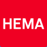

Cette été de nombreuses entreprises étrangères ont fait leur courses aux Pays-Bas. La mode des fusions et des acquisitions n'a pas de vacances alors en cette rentrée, voici comment **Connexxion**, **Unilever**, **Orange**, **ABN Amro**,  **HEMA** et **Numico** ont changé de main dernièrement

<!--excerpt-->

## Connexxion rachetée par la française Transdev
{.left}
À Amsterdam, les trams sont gérés par la régie municipale GVB mais les bus sont gérés par la société privée Connexxion. Cette compagnie assure les transports publics urbains de nombreuses villes de Hollande et d'au delà. Elle assure aussi des liaisons régionnales, des liaison en taxi et en ferry et possède aussi quelques 200 cars de tourisme et exploite une ligne ferroviaire. Bref, c'est l'une des plus grande société de transport Néerlandaise que le Géant français du domaine vient de racheter. Transdev, si vous ne le connaissez pas, sachez qu'en prenant un tram en France vous avez de fortes chances de vous retrouver dans un tram du groupe (TAN de Nantes, TAG de Grenoble, TAM de Montpelier...)  
* [Connexxion_in_Franse_handen](http://www.nu.nl/news/1134853/32/Connexxion_in_Franse_handen.html)  
* [Frans_Transdev_koopt_Connexxion](http://www.volkskrant.nl/economie/article441214.ece/Frans_Transdev_koopt_Connexxion)

## Unilever voudrait vendre Boursin
{.left} Unilever ne va pas très bien. Le groupe Néerlandais d'alimentaire et de produits d'hygiène et beauté est l'un des plus grand groupe du monde dans ce secteur (loin derière P&G). Sa taille ne lui permet plus aujourd'hui d'avoir une politique cohérente. C'est pourquoi Patrick Cescau, le PDG a annoncé récemment un plan de restructuration pour *optimiser la croissance mondiale du groupe*. C'est dans ce cadre que la fromagerie de Pacy-sur-Eure se retrouve en vente au plus offrant. Qui veut du Boursin ?  
* [Unilever wil Boursin verkopen](http://www.elsevierretail.nl/RetailHome/Nieuws/Food/KopieVanFood-nieuwsbericht/UnileverWilBoursinVerkopen.htm) dans Elsevier magazine

<!-- HTML -->

<!-- / HTML -->

## France Telecom vends Orange Nederland à Deutsche Telekom
{.left} **Au mois de juin** France Telecom a énormément investit dans l'internet espagnol avec nottement le rachat de Ya.com. La vente de sa filiale **Orange**  Pays-Bas à l'allemand **T-Mobile** (Deutsche Telekom) a été cité pour financer cette opération. Ce n'est pas à proprement parler la vente d'une entreprise Néerlandaise mais en regroupant les activités de T-Mobile et d'Orange, **Deutsche Telekom** compte ainsi se hisser à un niveau ou il peut entrer en compétition avec **KPN**. Cette rumeur circule depuis le mois de juin et la presse en a parlé alors ni FT ni DT ne l'ont confirmé. Les discussions ont eu lieu dans le plus grand secret et [ce rachat a été confirmé seulement ces jours ci](http://www.orange.nl/over_ons/over_orange/het_bedrijf/Orange_verkoop.html). France-Telecom conserverait sa filiale de connexion [Internet Orange](/wanadoo-devient-orange) et le cablo-opérateur **Casema**.  
* [Orange Nederland verkocht aan Deutsche Telekom](http://www.webwereld.nl/articles/46714/-orange-nederland-verkocht-aan-deutsche-telekom-.html)  
* [Deutsche Telekom koopt Orange Nederland](http://www.beurs.nl/nieuws/artikel.php?id=224972&taal=NL)

## Feuilleton ABN Amro: Reprise Hispano-Belgo-Ecossaise
{.left} En présentant cette banque, [ABN Amro, il y a six mois](/abn-amro-banque), j'expliquais que sa reprise par la Banque **Barclays** s'organisait. Une contre-OPA, organisée par la **Royal Bank of Scotland**, accompagnée de **Fortis** la Belgo-Néerlandaise et **Santander** l'espagnole a fait de cette affaire le feuilleton de l'été. Certaines entitées de **LaSalle**, la filiale étasunienne de ABN Amro ont été [vendues à](http://www.abnamro.com/pressroom/releases/2007/2007-01-22-nl.jsp)  **Citigroup** pour désinteresser [les banques](http://www.consortiumbid.com/nl/index.html). Puis le reste de LaSalle a été vendu à  **Bank of America** mais la vente a été annulée parce que les actionnaires n'avaient pas donné leur accord. ABN Amro a fait appel mais les trois banques ont affirmé que même sans LaSalle, ils restaient interessé par ABN Amro. Bank of America a menacé de réclamer des milliards au titre d'un préjudice si elle ne pouvait pas racheter pas LaSalle comme prévu. Finalement la revent e de LaSalle a été acceptée en appel et validée par les autorités et la direction d'ABN Amro a accepté la dernière offre des 3 banques en juillet. Le rachat sera effectif et annoncé quand les autorités (le Ministre des Finances) auront donné leur accord pour la vente de la plus grande banque des Pays-Bas. La banque Neerlandaise Fortis devrait ainsi devenir le premier réseau bancaire des Pays-Bas.  

* La suite aussi est intéressante, lire [Les déboires de la Royal Bank of Scotland](/les-deboires-de-la-royal-bank-of-scotland)  

## Le Britanique Lion Capital rachète HEMA
{.left} [Lion Capital](http://www.lioncapital.com/) est une société de capital-investissement britanique, *private equity investment firm* (*investeringsmaatschappij* en Néerlandais) qui s'est rendu célèbre l'année dernière en rachetant **Orangina** en France. Cette année la société a placé l'agent de ses investisseurs dans une chaine de magasins Néerlandaise particulière : **HEMA**. [HEMA est marque qui plait](/le-design-c-est-hema), on pourrait comparer cette enseigne à Monoprix en France. Les magasins, souvents en centre ville, vendent de l'alimentaire, de la décoration, du bricolage et des vêtements le plus souvent sous sa propre marque. Les produits sont réputés de qualité et bon marché.  
* [Warenhuis Hema is verkocht aan de Britse investeringsmaatschappij Lion Capital](http://www.parool.nl/nieuws/2007/JUN/02/eco5.html) in Het Parool  
* [Hema doorverkocht aan Lion Capital](http://www.fd.nl/ShowRedactieNieuws.asp?DocumentId=35513) selon le Financieele Dagblad

## Danone avale Numico
{.left} (Le titre n'est pas de moi). Je ne pense pas avoir a décrire le premier groupe allimantaire français. [Numico](http://www.numico.com) est peut être moins connu, il est un spécialiste mondial de l'alimentation clinique et de la nouriture pour bébés avec nottement la marque Nutrica. En 1997 Nomico a obtenu [le prédicat Royal](/koninklijk-le-predicat-royal) et s'appelle maintenant **Koninklijke Numico N.V.**. Danone avait du cash après la vente de sa division biscuits à l'américain Kraft food. Il utilise donc cet argent pour enrichir son département santé-bien-être en rachetant un leader.   
* [Danone lijkt er met ?hoofdprijs? Numico vandoor te gaan](http://www.nrc.nl/economie/article776118.ece/Danone_lijkt_er_met_hoofdprijs_Numico_vandoor_te_gaan) dans le NRC Handelsblad  
* [Danone doet bod op Numico](http://www.nos.nl/nosjournaal/artikelen/2007/7/9/090707_numico.html) sur NOS Journal

## D'autres...
Évidement la liste n'est pas exhaustive, cet année, beaucoup d'entreprises Néerlandaises ont été vendues à des sociétés étrangères sans que les Néerlandais ne s'en émmeuvent. Ici nul inquiétude sur la possible disparition d'emplois ou sur le *patriotisme financier*. Quelques notes parlant des plus-values réalisées par les actionnaires néerlandais précisent comment sont perçus ces rachats. Le pouvoir des actionnaires est ici très important et le feuilleton ABN Amro ou l'Assemblée Générale fut un moment clef, montre que ces derniers peuvent aller jusqu'à prendre des décisions contre les dirigeants pour quelques dollars de plus.

<!-- post notes:
http://www.nrc.nl/economie/article736586.ece/De_BV_Nederland_tegen_elk_aannemelijk_bod_ 
http://www.challenges.fr/actualites/business/20070515.CHA4588/chronologie_sur_la_bataille_autour_dabn_amro.html 
* [Fortis dichterbij overname ABN Amro|http://www.trouw.nl/hetnieuws/economie/article767414.ece/Fortis_dichterbij_overname_ABN_Amro] dans le Trouw%%%
--->
