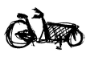
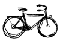

Ce week-end, n'oubliez pas de changer d'heure. À 3h00 du matin nous passons à l'heure d'hiver. En d'autres mots, nous repassons à l'heure normal de notre fuseau horaire. à Amsterdam, Paris comme à Berlin et Lisbonne, le dernier dimanche d'octobre marque la fin de l'heure d'été qui nous fait perdre soixante minutes par rapport à l'heure normale depuis 1976, pour sois-disant économiser de l'énergie[^1].

Dès dimanche la nuit tombera à 17h alors que la veille, elle arrivait à 18h. Ce n'est pas fini, l'hiver arrivant, les jours vont continuer à raccourcir, ce qui est plus marquant encore ici qu'à Paris. **Amsterdam est quelques 500km plus au nord de Paris** et la différence de luminosité entre les deux villes est bien visible. Pour les personnes photosensibles que nous sommes tous, c'est surtout pénible en hiver. Les après-midi couverts nous obligent à éclairer très tôt à la maison et c'est parfois déprimant[^2].

{.left}
Sinon, la vie continue normalement et tout le monde prend son vélo pour faire vaquer à ses occupations. Puisqu'il n'y a plus de lumière, il faut que chaque vélo soit équipé de son propre éclairage pour être bien visible des autres. C'est la loi. d'ailleurs, ici les policiers verbalisent facilement les cyclistes pour défaut de lumière. D'ailleurs avec l'heure d'hiver, beaucoup de distraits rentrent chez eux la nuit sans lumière alors que la veille il faisait jour à la même heure. Pour les flics, c'est la période préférée pour faire des barrages à cyclistes. Ils stationnent en nombre près d'une rue à fort passage et **arrêtent tous les cyclistes sans lampe allumée**. A 20? par infraction, les constables gagnent très vite de quoi se chauffer pendant l'hiver.

20€, c'est pas énorme, mais quand même, on aimerait toujours les dépenser autrement en cette période hivernale. Pour ma part, j'ai acheté des petites [lumières de poche](http://www.flickr.com/photos/mjaquet/1505368808) [chez HEMA](/le-design-c-est-hema) pour 4?. Ces lumières ont gagné le concours de design HEMA il y a quelques années et elles sont très bien pour ne pas laisser [mon vélo](/un-b-twin-a-amsterdam) dans le noir.

## Lire aussi :   
<!-- 
TODO: add back
!   
! -->

<!-- HTML -->

<a href="/plein-de-velos-hollandais" title="tout savoir sur la bicyclette aux Pays-Bas">
<!-- / HTML -->
**Plein de vélos hollandais**  
{.center}  
1) Les avantages  
<!-- HTML -->
</a>

<!-- / HTML -->

<!-- HTML -->

<a href="/plein-de-velos" title="tout savoir sur la bicyclette aux Pays-Bas">
<!-- / HTML -->
**Plein de vélos hollandais**  
{.center}  
2) Les styles
<!-- HTML -->
</a>

<!-- / HTML -->

<!-- HTML -->

<a href="/plein-de-velos-hollandais-3" title="tout savoir sur la bicyclette aux Pays-Bas">
<!-- / HTML -->
**Plein de vélos hollandais**  
{.center}  
3) Les marques
<!-- HTML -->
</a>

<!-- / HTML -->

<!-- HTML -->

<a href="/plein-de-velos-pas-hollandais-4" title="tout savoir sur la bicyclette aux Pays-Bas">
<!-- / HTML -->
**Plein de vélos hollandais**  
{.center}  
4) Les marques étrangères
<!-- HTML -->
</a>

<!-- / HTML -->

<!-- HTML -->

<a href="/une-heure-sans-velo" title="tout savoir sur la bicyclette aux Pays-Bas">
<!-- / HTML -->
**Plein de vélos hollandais**  
{.center}  
5) Parking à vélos
<!-- HTML -->
</a>

<!-- / HTML -->

<!-- HTML -->

<a href="/les-velos-de-location" title="tout savoir sur la bicyclette aux Pays-Bas">
<!-- / HTML -->
**Plein de vélos hollandais**  
{.center}  
6) Vélos de location
<!-- HTML -->
</a>

<!-- / HTML -->

<!-- HTML -->

<!-- / HTML -->
---
[^1]: Je ne comprend toujours pas en quoi ce changement d'heure peut faire économiser de l'électricité. Pour moi, optimiser l'éclairage public, c'est l'utiliser quand il y en a besoin et pas faire changer d'habitudes à tout le monde.
[^2]: Je ne suis pas le seul à le dire.