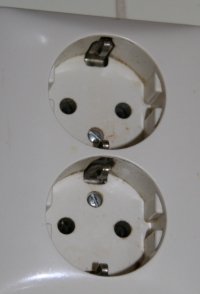
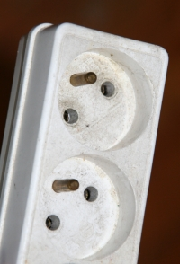
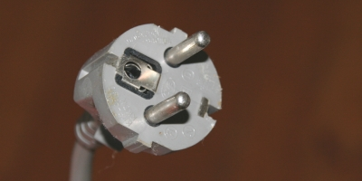

Pour les prises électriques, pas de problème ai-je dit en présentant celui des [prises de téléphone](/les-prises-telephoniques). C'était sans compter sur les petits détails, petits détails peuvent devenir des gros problèmes si l'on a besoin de brancher un appareil électrique français sur une prise électrique aux Pays-Bas. Voici ce qu'il faut savoir :

<!--excerpt-->

## Le courant électrique
**Pas de problème**, le courant délivré est du 220 volts. C'est le même qu'en France.

## Les fiches électriques
Pour les prises plates, **pas de problème**, le voyageur occasionnel pourra brancher son rasoir électrique et recharger son téléphone dans n'importe quelle prise électrique du pays.

## Les prises de terre différentes

Un petit dessin valant mieux qu'un grand discours, je vais vous montrer la différence entre les prises électriques des deux pays:

<!--excerpt-->

  

{.center}
**Prise électrique femelle aux Pays-Bas**  
**Type F ou SchuKo**  
La prise de terre se fait par deux ergots en haut et bas de la prise et des guides sur les cotés permettent d'aligner la prise dans le bon sens. Ce type de prise est aussi utilisé en Allemagne.
  

  

{.center}
**Prise électrique femelle en France**  
**Type E**  
La prise de terre se fait par une tige au fond et cette tige sert aussi de repère d'alignement
  

  

{.center}
**Prise électrique mâle universelle**  
**Type CEE 7/7**  
Une fiche électrique compatible doit présenter un trou pour la terre française en plus des contacts en haut ou en bas pour la terre hollandaise. Des guides sur les cotés doivent être présents pour l’alignement sur une prise en Hollande. La plupart des appareils électriques vendus en Europe utilisent cette norme.
  

Certaines prises mâles françaises sont rondes et les échancrures sur les cotés des prises hollandaises empêchent de les brancher. À l'inverse, les prises mâles hollandaises (et allemandes) n'ont pas toujours de trou pour la terre française et ne peuvent donc pas se brancher en France.

## Les adaptateurs

La meilleure solution est de veiller à ce que l'appareil que l'on veut brancher possède une prise mâle compatible avec les deux systèmes. Aujourd'hui c'est très souvent le cas. Sinon, il est toujours possible d'en acheter et d'en monter une. Votre appareil pourra ainsi se brancher aux Pays-Bas, en France mais aussi en Allemagne en Belgique, Espagne, Maroc, Grèce, Bulgarie, Autriche, Hongrie, République tchèque etc.

Si vous êtes malchanceux et que vous n'êtes pas bricoleur, sachez qu'il existe des adaptateurs comme indiqué en commentaire mais cette solution est une solution de dépannage temporaire. **Une solution plus pratique est d'acheter une rallonge ou une multiprise** dans le pays de compatibilité de l'appareil que l'on veut brancher, en prenant soin de vérifier que la fiche mâle de cette rallonge soit compatible avec les deux systèmes.

<!-- post notes:
http://www.pakata.com/blog/2014/02/prises-voltages-adaptateur-convertisseur/#Les_prises_Franaises_C_E_et_F_dans_le_monde
--->
