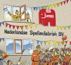
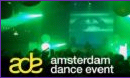

La semaine dernière a été chargée et celle qui vient va surement l'être tout autant. Pour donner rapidement des nouvelles je vais essayer une formule «en vrac et en vitesse» pour vous raconter comment se passe le vie de ce coté de la Moselle.

{.left}
Mercredi dernier, j'ai accompagné Sophie à l'[inauguration de l'usine de sa société](http://www.ad.nl/binnenland/article1750982.ece). La **Nederlandse Spellenfabriek B.V.** basée à **[Medemblik](http://www.fbg.nl/76720)** dans le nord de la Hollande. C'est une belle usine moderne avec plein de jolies boites de jeux partout. Pour l'occasion, Jumbo a lancé [un puzzle représentant l'innauguration](http://www.jumbo.nl/site/html/nl/nl/press?id=50) qui sera vendu au profit d'une fondation nommée Ronald McDonald.

Pendant que [François Fillon veut s'inspirer du "modèle" néerlandais|], de jeunes Néerlandais s'inspirent du *modèle français* et [brûlent des voitures](http://www.depers.nl/binnenland/114465/Drie-autos-in-brand-in-Adam-West.html) suite à la mort d'un jeune marocain. Même si les dégats son moins importants, on compare ces incidents aux incendies de novembre 2005 en France et grace à ça, Laurent est invité à [en parler à la télé](http://laurentchambon.blogspot.com/2007/10/sur-nova-ce-soir.html). Les incendies ont eu lieu [à Amsterdam](http://www.ad.nl/amsterdam/article1756380.ece) dans le quartier ouest appelé **Slotervaart**.

Slotervaart est aussi le quartier ou habite un collègue qui m'a **donné un frigo**. Je suis allé le chercher samedi avec un déménageur anglais nommé [Stuart](http://www.stuartfromengland.com/). Il avait prévue [une poulie](/de-haak-crochet) mais le frigo est passé par les escaliers. Je vais enfin pouvoir faire des glaçons.

{.right}
L'évènement de cette fin de semaine c'est ***Amsterdam Dance Event*** ([ADE](http://www.amsterdam-dance-event.nl/)), Le plus grand évènement dance d'Europe où des centaines de DJ internationaux enflamment les pistes de presque toutes les boites de la ville. Cette année on dirait que c'est Dave Clarke la tête d'affiche. Il y a surtout un trade show avec DJ mais surtout éditeurs et producteurs. [Laurent y était](http://laurentchambon.blogspot.com/2007/10/white-male-power-ade.html) mais je pense que le mieux était le soir. Le programme était alléchant et je n'ai pas su faire mon choix. Trop crevé aussi, je ne suis pas sorti.

**Le rugby** ? Aux Pays-Bas, on ne connait pas trop ce sport. Heureusement [des pubs](http://www.mulligans.nl/) retransmettent les matchs pour que les français et les anglais puisse regarder leur défaite. Pas la forme, trop crevé aussi, je n'y suis pas allé. Par contre ce dimanche c'est [le marathon d'Amsterdam](http://www.amsterdammarathon.nl/home/index.php).

[Le fournil de Sébastien](/le-fournil-de-sebastien) fait toujours un aussi bon pain. Le [site web de la boulangerie](http://www.lefournil.nl/) est maintenant en ligne.

La semaine prochaine est une grosse semaine, **[RIPE 55](/c-etait-ripe-55-meeting)**, le meeting organisé par [ma boite](/mon-nouveau-boulot-3), une réunion de toute la *communauté Internet* d'Europe va m'occuper du matin au soir. Cette année pour la première fois, [le site de l'évènement](http://www.ripe.net/ripe/meetings/ripe-meetings/ripe-55/sessions-archive) est public et il y aura même [des photos sur flickr](http://www.flickr.com/photos/ripe-55/). Encore une semaine intense qui s'annonce avant la torpeur hivernale.
---