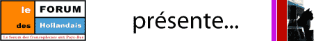

Dans [un agenda bien rempli](/agenda-bien-rempli), je vous présentais *ze agenda français des Pays-Bas* mais cet agenda devient  limité quand il s'aggit de sorties non françaises. Pourtant, les français des Pays-Bas ne sortent pas que pour voir leurs compatriotes. Alors comment trouver des idées de sorties quand on ne parle pas la langue de Willem Godschalk van Foquenbroch ?

<!--excerpt-->

Il y a biensûr **le forum** et sa section **bons plans**, dont [je vous parlais l'année dernière](/le-forum-des-hollandais) à l'occasion du [beaujolais nouveau](http://www.leforum.nl/phpBB/viewtopic.php?t=11923). Les propositions sont nombreuses mais on n'y trouve pas toujours des programmes détaillés.

Ce n'est pas le cas du [programme de novembre](http://www.montagnesdespaysbas.com/?p=171) proposé sur le blog [montagnesdespaysbas.com](http://www.montagnesdespaysbas.com/). Ces *idées de sorties* pour le mois de novembre sont celles d'une française d'Amsterdam. Elle a ouvert son blog au titre en oxymore un an avant le mien et comme moi, elle y parle un peu d'elle et beaucoup du plat pays.

Puisque j'évoque **les blogs français d'Amsterdam**, j'en profite pour parler aussi de [One day in Dam](http://onedayindam.blogspot.com/). Le titre du blog est lui aussi trompeur puisque son auteur est à Amsterdam depuis plus d'un jour (et même plus longtemps que moi). Lui aussi présente parfois son expérience du pays et ses sorties. Ces une sorte d'agenda *a posteriori* qui donne des idées pour l'année prochaines comme son tout recent post en guise de [compte rendu de la museum nacht](http://onedayindam.blogspot.com/2007/11/perfect-night-for-n8.html) (la **n8** dont je vous parlais [la semaine dernière](/le-design-el-hema)). Lui aussi a un agenda bien rempli.

Peut être que tous les deux se retrouveront au prochain rendez-vous du forum, la soirée du beaujolais nouveau...

[{.center}](http://www.leforum.nl/phpBB/viewtopic.php?t=11923&postdays=0&postorder=asc&start=0)

<!-- post notes:
Registrant Contact:
particulier
Vincent Poeze (domreg@widexs.nl)
+31206810681
Fax:
Jacob Catskade 10 huis
Amsterdam, Noord-Holland 1052 BW
NL  

http://hollande.over-blog.com/
--->
